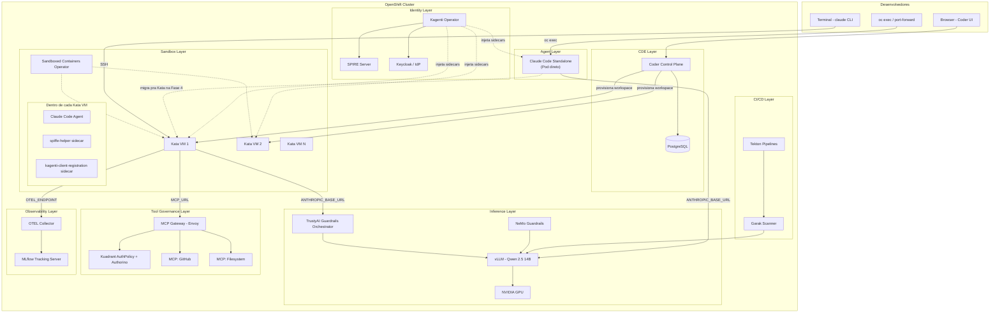
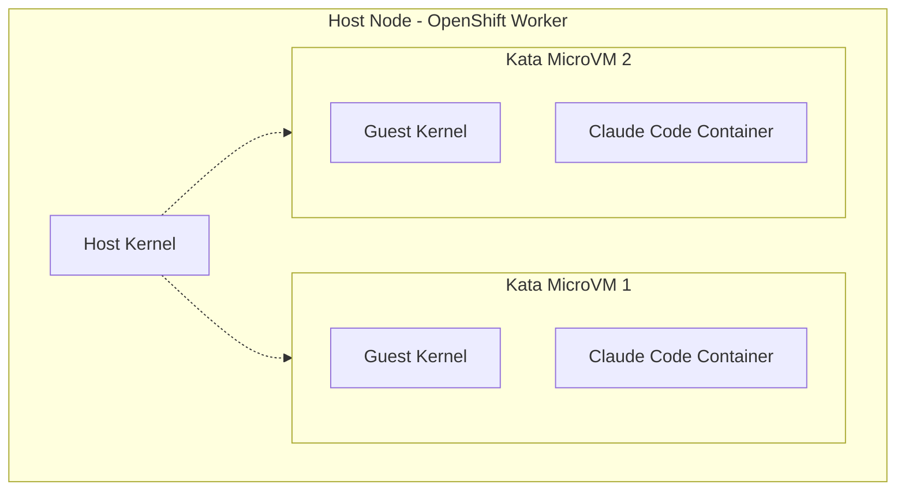
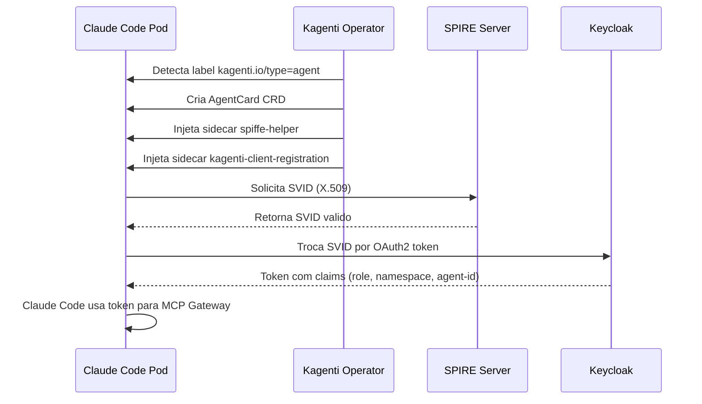
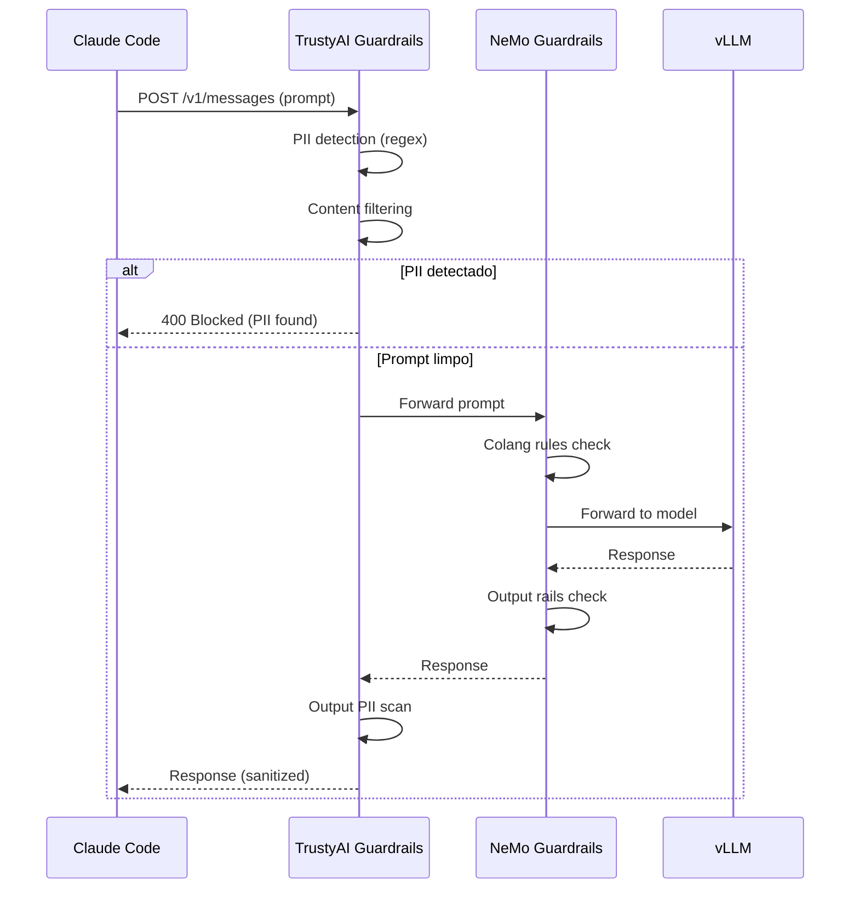
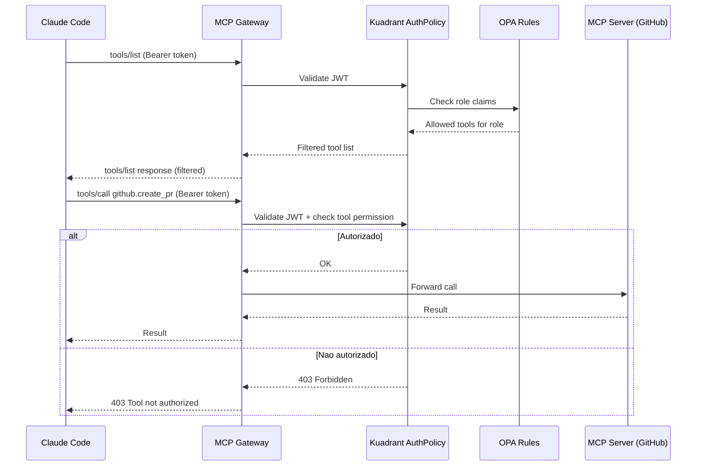
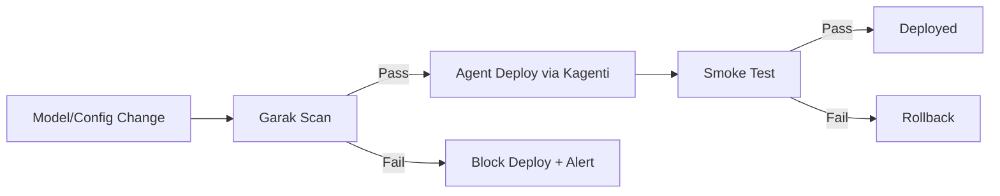
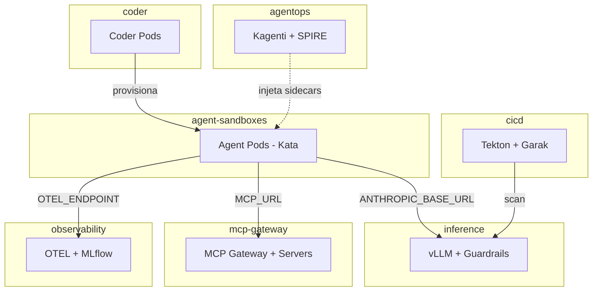

# Architecture: AgentOps Platform

**Status:** Draft
**Data:** 2026-04-08
**Relacionado:** [PRD](prd.md) | [ADRs](../adrs/)

---

## 1. Visao geral

A plataforma AgentOps roda AI coding agents (Claude Code) no OpenShift com isolamento, identidade, governanca, observabilidade e safety — sem modificar o codigo do agente (principio BYOA).

```
                    ┌─────────────────────────────────────────────┐
                    │              OpenShift Cluster               │
                    │                                             │
Developer ──┬──> Coder (CDE) ──> Kata VM (agente) ──> MCP Gateway│
            │                         │                    │      │
            │                         v                    v      │
            │                   Guardrails ──> vLLM    AuthPolicy │
            │                         │                           │
            └──> Claude Code ─────────┘                           │
                 (standalone)         v                           │
                                OTEL ──> MLflow                   │
                    └─────────────────────────────────────────────┘
```

Claude Code pode rodar em dois modos: **standalone** (pod direto, headless/interativo via `oc exec`) ou **CDE-embedded** (dentro de workspace Coder). O standalone sobe primeiro (Fase 1) pra validar o core agente+modelo antes de montar o CDE.

## 2. Diagrama de arquitetura



## 3. Camadas da arquitetura

### 3.0 Agent Layer (Claude Code)

**Responsabilidade:** Executar o agente de codificacao. Funciona independente do CDE.

| Componente | Tecnologia | Namespace |
|---|---|---|
| Runtime | Node.js 20 + Claude Code CLI | `agent-sandboxes` |
| Modo standalone | Pod direto (`oc exec` / headless API) | `agent-sandboxes` |
| Modo CDE | Embarcado no Coder workspace template | `agent-sandboxes` |
| Config | ConfigMap compartilhado (env vars do agente) | `agent-sandboxes` |

**Dois modos de operacao:**

| Modo | Disponivel | Surface | Use case |
|---|---|---|---|
| **Standalone** | Fase 1 | `oc exec`, headless API, port-forward | Validacao core, automacao, CI/CD |
| **CDE-embedded** | Fase 3 | Coder workspace (VS Code / terminal) | Dev interativo |

**Standalone deploy (Fase 1):**
1. Pod com imagem custom UBI (`registry.access.redhat.com/ubi9/nodejs-22` + Claude Code CLI)
2. `ANTHROPIC_BASE_URL` aponta direto pro vLLM (sem Guardrails ainda)
3. Dev interage via `oc exec -it` ou `kubectl port-forward`
4. Valida: agente conversa com modelo local, responde prompts de coding

**Evolucao ao longo das fases:**
- **Fase 1:** Standalone → vLLM direto
- **Fase 2:** Standalone → Guardrails → vLLM
- **Fase 3:** Coder workspace herda mesma config via ConfigMap
- **Fase 4:** Ambos migram pra Kata (`runtimeClassName: kata`)
- **Fase 5+:** SPIFFE identity, MCP Gateway, OTEL

**ConfigMap compartilhado** (reusado por standalone e Coder templates):

```yaml
apiVersion: v1
kind: ConfigMap
metadata:
  name: claude-code-config
  namespace: agent-sandboxes
data:
  ANTHROPIC_BASE_URL: "http://qwen25-14b.inference.svc.cluster.local:8080"
  ANTHROPIC_DEFAULT_SONNET_MODEL: "qwen25-14b"
  ANTHROPIC_DEFAULT_OPUS_MODEL: "qwen25-14b"
  ANTHROPIC_DEFAULT_HAIKU_MODEL: "qwen25-14b"
  ANTHROPIC_AUTH_TOKEN: "not-needed"
  CLAUDE_CODE_DISABLE_NONESSENTIAL_TRAFFIC: "1"
  CLAUDE_CODE_SKIP_FAST_MODE_NETWORK_ERRORS: "1"
  CLAUDE_CODE_ATTRIBUTION_HEADER: "0"
  CLAUDE_CODE_MAX_OUTPUT_TOKENS: "2048"
  MAX_THINKING_TOKENS: "0"
```

> Ver [ADR-008](../adrs/008-claude-code-standalone-deploy.md) para o racional desta decisao.

### 3.1 CDE Layer (Coder)

**Responsabilidade:** Prover workspaces de desenvolvimento isolados com IDE integrado.

| Componente | Tecnologia | Namespace |
|---|---|---|
| Control plane | Coder v2 (Helm) | `coder` |
| Database | PostgreSQL | `coder` |
| Workspace templates | Terraform | N/A (provisionados dinamicamente) |
| Auth | OIDC (OpenShift OAuth) | `coder` |

**Fluxo:**
1. Dev acessa Coder UI via Route (TLS)
2. Autentica via OpenShift OAuth
3. Cria workspace a partir de template Terraform
4. Template provisiona pod com `runtimeClassName: kata` no namespace `agent-sandboxes`
5. Pod contem Claude Code pre-instalado + env vars configuradas

**Workspace template inclui:**
- Node.js 20 + Claude Code CLI
- Git + ferramentas de dev
- Env vars: `ANTHROPIC_BASE_URL`, `MCP_URL`, `OTEL_EXPORTER_OTLP_ENDPOINT`
- `runtimeClassName: kata`
- Labels: `kagenti.io/type: agent`

### 3.2 Sandbox Layer (Kata Containers)

**Responsabilidade:** Isolamento de kernel por agente via microVM.

| Componente | Tecnologia | Namespace |
|---|---|---|
| Operator | OpenShift Sandboxed Containers | `openshift-sandboxed-containers-operator` |
| Runtime | Kata Containers + QEMU/Cloud Hypervisor | Nodes (kernel-level) |
| Config | KataConfig CRD | Cluster-scoped |

**Modelo de isolamento:**



- Cada pod roda dentro de uma VM com kernel proprio
- `privileged: true` dentro da VM nao da acesso ao host
- `privileged_without_host_devices=true` impede acesso a devices do host
- NetworkPolicy restringe egress: so MCP Gateway, Guardrails, DNS, OTEL Collector

### 3.3 Identity Layer (Kagenti + SPIFFE)

**Responsabilidade:** Identidade criptografica por agente, auto-discovery, lifecycle.

| Componente | Tecnologia | Namespace |
|---|---|---|
| Operator | Kagenti Operator | `agentops` |
| Identity | SPIRE Server | `agentops` |
| Token exchange | Keycloak | `agentops` (ou existente) |
| CRDs | AgentCard | `agent-sandboxes` |

**Fluxo de identidade:**



**SPIFFE ID format:** `spiffe://<trust-domain>/ns/<namespace>/sa/<service-account>`

### 3.4 Inference Layer (vLLM + Guardrails)

**Responsabilidade:** Servir modelo localmente com guardrails na boundary.

| Componente | Tecnologia | Namespace |
|---|---|---|
| Model serving | Upstream vLLM v0.19.0 (ADR-011) | `inference` |
| Deploy method | Plain Deployment+Service (ADR-012) | `inference` |
| Modelo | Qwen 2.5 14B Instruct FP8-dynamic | `inference` |
| GPU | NVIDIA L4 24GB (1x) | — |
| Guardrails (GA) | TrustyAI Guardrails Orchestrator | `inference` |
| Guardrails (TP) | NeMo Guardrails | `inference` |

**Tuning para L4 24GB (Sprint 1):**

| Parametro | Valor | Racional |
|---|---|---|
| `--max-model-len` | `24576` | System prompt ~12K + output 2K + margem. 32K excede KV cache do L4. |
| `--gpu-memory-utilization` | `0.95` | Maximiza capacidade no L4 24GB |
| `--enforce-eager` | ativado | Desabilita CUDA graph capture. Necessario: (1) GPU memory pressure com 95% utilization, (2) OpenShift dropa `ALL` capabilities incluindo `IPC_LOCK` |
| `--enable-chunked-prefill` | ativado | Permite processar prefill em chunks, reduz memory spikes em prompts grandes (~12K system prompt) |
| `--tool-call-parser=hermes` | hermes | Parser de tool calls compativel com Qwen (template Hermes) |
| `model-cache` volume | PVC 30Gi (gp3-csi) | Modelo (~16GB com cache) persiste entre restarts. PVC criado via `infra/vllm/manifests/pvc.yaml`. |

**Fluxo de request:**



**Detectors configurados:**
- PII: email, telefone, CPF, cartao de credito, IP (regex)
- Content: jailbreak patterns, prompt injection heuristics
- Output: PII leak prevention, format validation

### 3.5 Tool Governance Layer (MCP Gateway)

**Responsabilidade:** Controlar quais ferramentas cada agente pode acessar, por identidade.

| Componente | Tecnologia | Namespace |
|---|---|---|
| Gateway | MCP Gateway (Envoy-based) | `mcp-gateway` |
| Auth | Kuadrant AuthPolicy + Authorino | `mcp-gateway` |
| Policy engine | OPA (via Authorino) | `mcp-gateway` |
| MCP servers | GitHub, Filesystem, etc. | `mcp-gateway` |

**Fluxo de tool call:**



**Modelo de seguranca:**
- Prompt injection que tenta chamar tool nao-autorizado morre no gateway
- Gateway valida token claims, ignora conteudo do prompt
- Token exchange: tokens broad sao trocados por tokens scoped por backend (RFC 8693)
- Credenciais de MCP servers ficam no Vault/Secrets, nunca no agente

### 3.6 Observability Layer (OTEL + MLflow)

**Responsabilidade:** Capturar traces de todas as acoes do agente.

| Componente | Tecnologia | Namespace |
|---|---|---|
| Collector | OpenTelemetry Collector | `observability` |
| Tracking | MLflow Tracking Server | `observability` |
| Storage | S3 / PV | `observability` |

**Dados capturados:**
- Prompts enviados ao modelo
- Reasoning steps
- Tool invocations (qual tool, params, resultado)
- Tokens consumidos (input, output, cache)
- Latencia por step
- Arquivos modificados, linhas adicionadas/removidas
- Acceptance rate de sugestoes

**Env vars no agente:**
```
OTEL_EXPORTER_OTLP_ENDPOINT=http://otel-collector.observability.svc:4317
```

### 3.7 CI/CD Layer (Tekton + Garak)

**Responsabilidade:** Safety scan antes de promover modelos/agentes.

| Componente | Tecnologia | Namespace |
|---|---|---|
| Pipelines | Tekton Pipelines | `cicd` |
| Scanner | Garak | `cicd` |

**Pipeline:**



## 4. Namespaces e NetworkPolicy



**Regras de NetworkPolicy:**

| Source | Destination | Porta | Protocolo |
|---|---|---|---|
| `agent-sandboxes` | `inference` (Guardrails) | 8080 | HTTPS |
| `agent-sandboxes` | `mcp-gateway` | 8443 | HTTPS |
| `agent-sandboxes` | `observability` (OTEL) | 4317 | gRPC |
| `agent-sandboxes` | `kube-dns` (openshift-dns) | 53, 5353 | UDP/TCP (ADR-013: CoreDNS escuta em 5353, OVN-K avalia post-DNAT) |
| `agent-sandboxes` | K8s API server | 443, 6443 | TCP (service account auth) |
| `agent-sandboxes` | Internet (GitHub, npm) | 443 | HTTPS (egress controlado) |
| `agent-sandboxes` (build pods) | Qualquer destino | * | Unrestricted (short-lived, pull images + push registry) |
| `coder` | `agent-sandboxes` | * | Provisioning |
| `agentops` | `agent-sandboxes` | * | Sidecar injection |
| `cicd` | `inference` | 8080 | HTTPS (Garak scan) |
| **DENY** | `agent-sandboxes` --> qualquer outro | * | * |

## 5. Env vars do agente

Configuradas via ConfigMap `claude-code-config` no namespace `agent-sandboxes`. Consumidas tanto pelo pod standalone quanto pelos Coder workspace templates.

**Refs:** [vLLM Claude Code docs](https://docs.vllm.ai/en/latest/serving/integrations/claude_code/) | [Red Hat Developer article](https://developers.redhat.com/articles/2026/03/26/integrate-claude-code-red-hat-ai-inference-server-openshift) | [Issue #36998](https://github.com/anthropics/claude-code/issues/36998)

| Variavel | Fase 1 (standalone) | Fase 2+ (com Guardrails) | Proposito |
|---|---|---|---|
| `ANTHROPIC_BASE_URL` | `http://qwen25-14b.inference.svc.cluster.local:8080` | `http://guardrails-orchestrator-gateway.inference.svc:8080` | Endpoint de inferencia (sem `/v1` — upstream vLLM v0.19.0 implementa Anthropic Messages API; ADR-011, ADR-012) |
| `ANTHROPIC_API_KEY` | `not-needed` | Injetado via SPIFFE token exchange | Identidade do agente (vLLM nao requer auth por padrao) |
| `ANTHROPIC_AUTH_TOKEN` | `not-needed` | Token SPIFFE | Header `Authorization: Bearer` (obrigatorio) |
| `ANTHROPIC_DEFAULT_SONNET_MODEL` | `qwen25-14b` | `qwen25-14b` | Deve ser o `--served-model-name` do vLLM, nao o HF ID |
| `ANTHROPIC_DEFAULT_OPUS_MODEL` | `qwen25-14b` | `qwen25-14b` | Mesmo modelo pra todos os tiers |
| `ANTHROPIC_DEFAULT_HAIKU_MODEL` | `qwen25-14b` | `qwen25-14b` | Mesmo modelo pra todos os tiers |
| `CLAUDE_CODE_DISABLE_NONESSENTIAL_TRAFFIC` | `1` | `1` | Impede conexoes de startup ao api.anthropic.com (issue #36998) |
| `CLAUDE_CODE_SKIP_FAST_MODE_NETWORK_ERRORS` | `1` | `1` | Evita falha no modo interativo em pods sem internet |
| `CLAUDE_CODE_ATTRIBUTION_HEADER` | `0` | `0` | Desabilita hash por-request que quebra prefix caching no vLLM |
| `CLAUDE_CODE_MAX_OUTPUT_TOKENS` | `2048` | `2048` | System prompt do Claude Code consome ~12K tokens; 2048 output cabe no context de 24K |
| `MAX_THINKING_TOKENS` | `0` | `0` | Desabilitado para Qwen |
| `CLAUDE_CODE_ENABLE_TELEMETRY` | N/A | `1` | Habilita OTEL nativo do Claude Code |
| `OTEL_EXPORTER_OTLP_ENDPOINT` | N/A | `http://otel-collector.observability.svc:4317` | Traces |

## 6. Decisoes arquiteturais

Ver [ADRs](../adrs/) para o racional de cada decisao.

| ADR | Decisao |
|---|---|
| ADR-001 | Kata Containers para isolamento (nao gVisor) |
| ADR-002 | vLLM com Qwen 2.5 14B para inferencia local |
| ADR-003 | Coder como CDE inicial (Dev Spaces futuro) |
| ADR-004 | MCP Gateway para governanca de tools (nao config manual) |
| ADR-005 | TrustyAI como proxy entre agente e modelo |
| ADR-006 | SPIFFE/Kagenti para identidade (nao API keys) |
| ADR-007 | Garak em pipeline Tekton (nao scan manual) |
| ADR-008 | Claude Code standalone antes do Coder (fail fast) |
| ADR-009 | UBI base image para agente (nao node:slim community) |
| ADR-010 | Estrutura `infra/` para manifests e scripts |
| ADR-011 | Upstream vLLM (nao RHAIIS) — Anthropic Messages API ausente no downstream |
| ADR-012 | Plain Deployment+Service (nao KServe) — controle de imagem e probes |
| ADR-013 | NetworkPolicy fixes para OVN-Kubernetes (DNS ClusterIP, build pods) |
