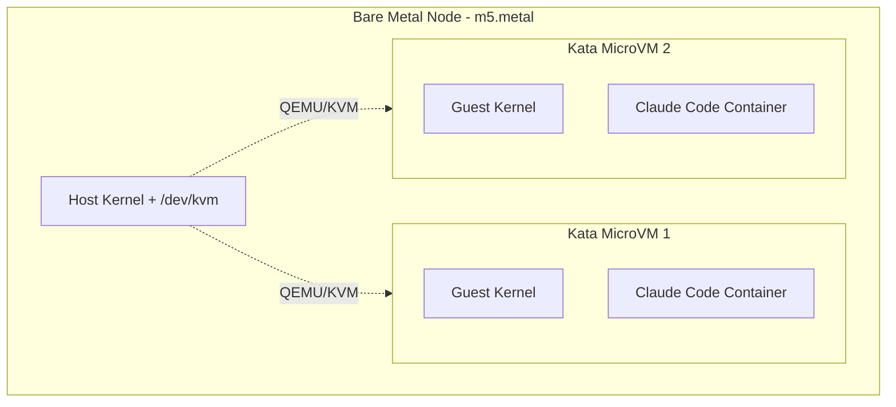
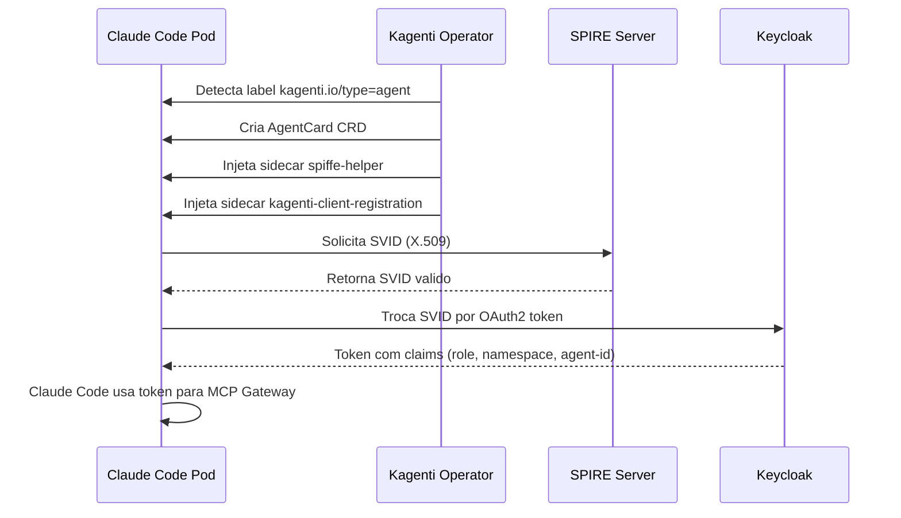
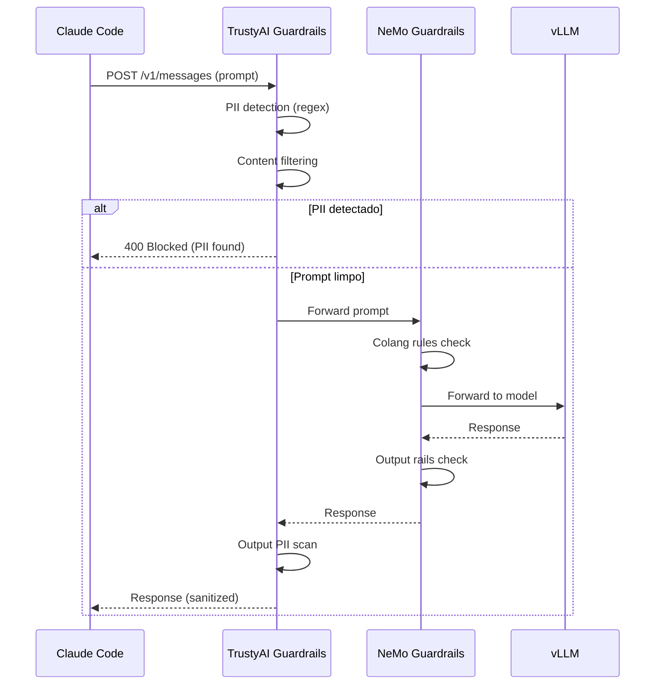
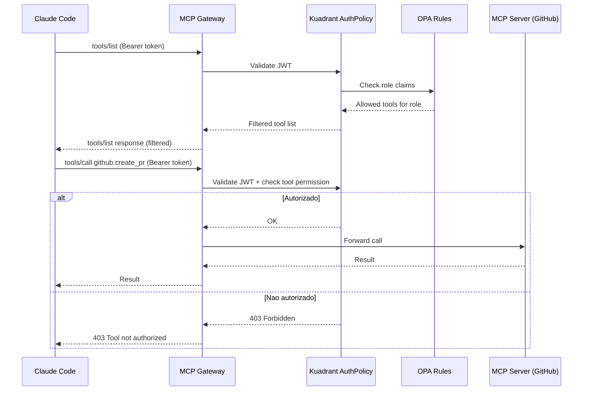
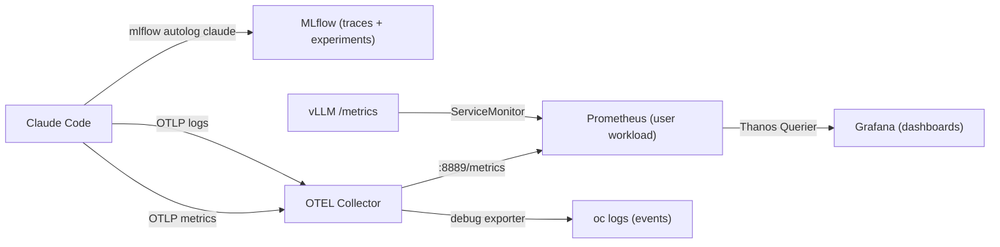
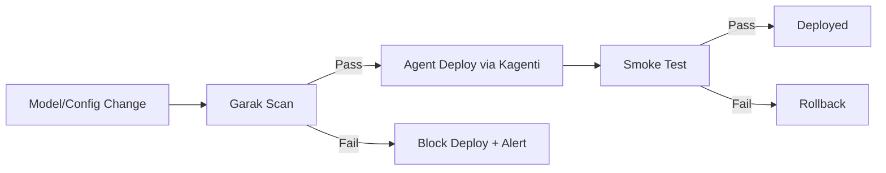
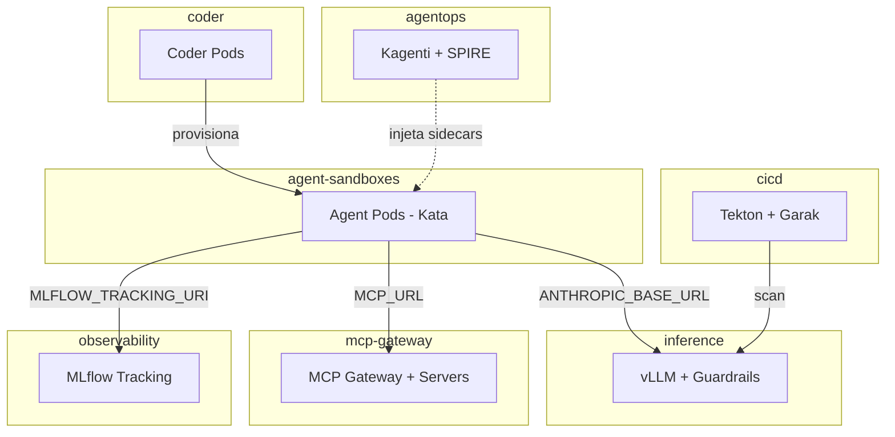

# Architecture: AgentOps Platform

**Status:** Draft
**Data:** 2026-04-08
**Relacionado:** [PRD](PRD.md) | [ADRs](../adrs/)

---

## 1. Visao geral

A plataforma AgentOps roda AI coding agents (Claude Code) no OpenShift com isolamento, identidade, governanca, observabilidade e safety — sem modificar o codigo do agente (principio BYOA).

```
┌─ OpenShift Cluster (4.16+) ──────────────────────────────────────────────────┐
│                                                                              │
│  ┌─ GPU Node (g6e.4xlarge · 1x L40S 48GB) ───────────────────────────────┐  │
│  │                                                                        │  │
│  │  ┌─ ns: inference ─────────────────────────────────────────────────┐   │  │
│  │  │                                                                 │   │  │
│  │  │  ┌─ Deployment: qwen25-14b ──────────────────────────────────┐  │   │  │
│  │  │  │  vLLM v0.19.0 · Qwen 2.5 14B FP8                        │  │   │  │
│  │  │  │  /v1/messages (Anthropic) · /v1/chat/completions (OpenAI) │  │   │  │
│  │  │  │  max_model_len=32768 · gpu-mem-util=0.90                  │  │   │  │
│  │  │  │  PVC 30Gi (model cache)                                   │  │   │  │
│  │  │  └───────────────────────────────────────────────────────────┘  │   │  │
│  │  │                                                                 │   │  │
│  │  │  ┌─ TrustyAI Guardrails (Fase 2+) ──────────────────────────┐  │   │  │
│  │  │  │  PII detection · content filtering · output rails         │  │   │  │
│  │  │  └───────────────────────────────────────────────────────────┘  │   │  │
│  │  └─────────────────────────────────────────────────────────────────┘   │  │
│  └────────────────────────────────────────────────────────────────────────┘  │
│                                                                              │
│  ┌─ Bare Metal Node (m5.metal · 96 vCPU · 384GB RAM · /dev/kvm) ────────┐  │
│  │  ADR-017: Kata requer /dev/kvm — EC2 VMs regulares nao suportam      │  │
│  │                                                                        │  │
│  │  ┌─ ns: agent-sandboxes ───────────────────────────────────────────┐  │  │
│  │  │                                                                  │  │  │
│  │  │  ┌─ Deployment: claude-code-standalone (xN replicas) ────────┐  │  │  │
│  │  │  │  ┌─ Kata MicroVM (runtimeClassName: kata) ────────────┐  │  │  │  │
│  │  │  │  │  Guest kernel (isolado do host via QEMU/KVM)       │  │  │  │  │
│  │  │  │  │  UBI9 + Node.js 22 + Claude Code CLI                │  │  │  │  │
│  │  │  │  │  entrypoint.sh → sleep infinity (invoked via exec)  │  │  │  │  │
│  │  │  │  │  claude-logged → NDJSON to oc logs                   │  │  │  │  │
│  │  │  │  │  spiffe-helper sidecar · kagenti-client sidecar      │  │  │  │  │
│  │  │  │  │  ──→ ANTHROPIC_BASE_URL → vLLM (ns:inference)        │  │  │  │  │
│  │  │  │  └─────────────────────────────────────────────────────┘  │  │  │  │
│  │  │  └───────────────────────────────────────────────────────────┘  │  │  │
│  │  │                                                                  │  │  │
│  │  │  ┌─ Coder Workspace Pods (Fase 3+) ─────────────────────────┐  │  │  │
│  │  │  │  ┌─ Kata MicroVM ──────────────────────────────────────┐  │  │  │  │
│  │  │  │  │  Guest kernel (isolado do host)                     │  │  │  │  │
│  │  │  │  │  Claude Code + VS Code + git                        │  │  │  │  │
│  │  │  │  │  spiffe-helper sidecar · kagenti-client sidecar     │  │  │  │  │
│  │  │  │  │  ──→ Guardrails → vLLM                              │  │  │  │  │
│  │  │  │  │  ──→ MCP Gateway (tools governados)                 │  │  │  │  │
│  │  │  │  │  ──→ MLflow (traces via mlflow autolog claude)       │  │  │  │  │
│  │  │  │  └─────────────────────────────────────────────────────┘  │  │  │  │
│  │  │  └───────────────────────────────────────────────────────────┘  │  │  │
│  │  └──────────────────────────────────────────────────────────────────┘  │  │
│  │                                                                        │  │
│  │  ┌─ ns: coder ────────────┐  ┌─ ns: mcp-gateway ──────────────────┐  │  │
│  │  │  Coder v2 (Helm)       │  │  MCP Gateway (Envoy)                │  │  │
│  │  │  PostgreSQL             │  │  Kuadrant AuthPolicy + OPA          │  │  │
│  │  │  Route (TLS + OIDC)    │  │  MCP servers: GitHub, Filesystem    │  │  │
│  │  └─────────────────────────┘  └────────────────────────────────────┘  │  │
│  │                                                                        │  │
│  │  ┌─ ns: observability ────┐  ┌─ ns: agentops ─────────────────────┐  │  │
│  │  │  MLflow Tracking v3    │  │  Kagenti Operator                   │  │  │
│  │  │                        │  │  SPIRE Server (SVID X.509)          │  │  │
│  │  │                        │  │  Keycloak (token exchange)         │  │  │
│  │  └─────────────────────────┘  │                                    │  │  │
│  │                                └────────────────────────────────────┘  │  │
│  │                                                                        │  │
│  │  ┌─ ns: cicd ─────────────┐                                           │  │
│  │  │  Tekton Pipelines      │                                           │  │
│  │  │  Garak (safety scan)   │                                           │  │
│  │  └─────────────────────────┘                                           │  │
│  └────────────────────────────────────────────────────────────────────────┘  │
└──────────────────────────────────────────────────────────────────────────────┘

Acesso:
  Developer ──oc exec──→ Claude Code standalone pod
  Developer ──Browser──→ Web Terminal (ttyd :7681) ──→ Claude Code interactive
  Developer ──Slack────→ slack-bridge ──oc exec──→ Claude Code one-shot
  Developer ──Browser──→ Coder UI ──→ Coder workspace (Kata VM)
```

Claude Code pode rodar em dois modos: **standalone** (pod direto, headless/interativo via `oc exec`) ou **CDE-embedded** (dentro de workspace Coder). O standalone sobe primeiro (Fase 1) pra validar o core agente+modelo antes de montar o CDE.

## 2. Diagrama de arquitetura

```mermaid
flowchart TB
    subgraph devs [Desenvolvedores]
        DevBrowser[Browser - Coder UI]
        DevWebTerm["Browser - Web Terminal (ttyd)"]
        DevTerminal[Terminal - claude CLI]
        DevExec["oc exec / port-forward"]
    end

    subgraph ocp [OpenShift Cluster]

        subgraph agent [Agent Layer]
            StandalonePod["Claude Code Standalone<br>(Pod direto)"]
        end

        subgraph cde [CDE Layer]
            CoderCP[Coder Control Plane]
            PG[(PostgreSQL)]
            CoderCP --> PG
        end

        subgraph identity [Identity Layer]
            Kagenti[Kagenti Operator]
            SPIRE[SPIRE Server]
            Keycloak[Keycloak / IdP]
            Kagenti --> SPIRE
            Kagenti --> Keycloak
        end

        subgraph sandbox [Sandbox Layer]
            SandboxOp[Sandboxed Containers Operator]
            KataVM1["Kata VM 1"]
            KataVM2["Kata VM 2"]
            KataVMN["Kata VM N"]

            subgraph insideVM ["Dentro de cada Kata VM"]
                ClaudeCode[Claude Code Agent]
                SPIFFEHelper[spiffe-helper sidecar]
                KagentiReg[kagenti-client-registration sidecar]
            end

            SandboxOp -.-> KataVM1
            SandboxOp -.-> KataVM2
        end

        subgraph inference [Inference Layer]
            GuardrailsOrch[TrustyAI Guardrails Orchestrator]
            NeMoGR[NeMo Guardrails]
            vLLMServ["vLLM - Qwen 2.5 14B"]
            GPU[NVIDIA GPU]

            GuardrailsOrch --> vLLMServ
            NeMoGR --> vLLMServ
            vLLMServ --> GPU
        end

        subgraph toolGov [Tool Governance Layer]
            MCPGateway[MCP Gateway - Envoy]
            AuthPolicy[Kuadrant AuthPolicy + Authorino]
            MCPGitHub[MCP: GitHub]
            MCPFilesystem[MCP: Filesystem]

            MCPGateway --> AuthPolicy
            MCPGateway --> MCPGitHub
            MCPGateway --> MCPFilesystem
        end

        subgraph observability [Observability Layer]
            MLflowServer[MLflow Tracking Server]
        end

        subgraph cicd [CI/CD Layer]
            TektonPipeline[Tekton Pipelines]
            GarakScanner[Garak Scanner]
            TektonPipeline --> GarakScanner
            GarakScanner --> vLLMServ
        end

    end

    DevBrowser --> CoderCP
    DevWebTerm -->|"HTTPS Route :7681"| StandalonePod
    DevTerminal -->|SSH| KataVM1
    DevExec -->|"oc exec"| StandalonePod

    StandalonePod -->|"ANTHROPIC_BASE_URL"| vLLMServ
    StandalonePod -.->|"migra pra Kata na Fase 4"| KataVM1

    CoderCP -->|"provisiona workspace"| KataVM1
    CoderCP -->|"provisiona workspace"| KataVM2

    Kagenti -.->|"injeta sidecars"| KataVM1
    Kagenti -.->|"injeta sidecars"| KataVM2
    Kagenti -.->|"injeta sidecars"| StandalonePod

    KataVM1 -->|"ANTHROPIC_BASE_URL"| GuardrailsOrch
    KataVM1 -->|"MCP_URL"| MCPGateway
    KataVM1 -->|"MLFLOW_TRACKING_URI"| MLflowServer
```



## 3. Camadas da arquitetura

### 3.0 Agent Layer (Claude Code)

**Responsabilidade:** Executar o agente de codificacao. Funciona independente do CDE.

| Componente | Tecnologia | Namespace |
|---|---|---|
| Runtime | Node.js 22 + Claude Code CLI | `agent-sandboxes` |
| Modo standalone | Deployment (N replicas, `oc exec` / headless API) | `agent-sandboxes` |
| Modo CDE | Embarcado no Coder workspace template | `agent-sandboxes` |
| Config | ConfigMap compartilhado (env vars do agente) | `agent-sandboxes` |

**Dois modos de operacao:**

| Modo | Disponivel | Surface | Use case |
|---|---|---|---|
| **Standalone** | Fase 1 | Web Terminal (ttyd), `oc exec`, Slack bridge, headless API | Validacao core, demos, automacao, CI/CD |
| **CDE-embedded** | Fase 3 | Coder workspace (VS Code / terminal) | Dev interativo |

**Standalone deploy:**
1. Deployment com N replicas (imagem custom UBI `registry.access.redhat.com/ubi9/nodejs-22` + Claude Code CLI + ttyd)
2. Cada replica eh um agente independente com seu proprio `session_id` e log stream
3. `ANTHROPIC_BASE_URL` aponta direto pro vLLM (Fase 1) ou Guardrails (Fase 2+)
4. Dev interage via **Web Terminal** (browser → ttyd :7681), `oc exec -it <pod>`, Slack, ou headless API
5. Escala horizontal: `oc scale deployment/claude-code-standalone --replicas=N`

**Multi-agente standalone:**
- Cada pod standalone eh independente — sem estado compartilhado entre agentes
- Todos compartilham o mesmo ConfigMap, imagem e vLLM endpoint
- vLLM suporta concorrencia via batching automatico (L40S com margem de KV cache)
- ResourceQuota do namespace `agent-sandboxes` limita o numero maximo de pods

**Logging (ADR-015):**

| Comando | Formato | Aparece no `oc logs` |
|---|---|---|
| `claude` | TUI interativo | Nao |
| `claude -p "..."` | Texto pro caller | Nao |
| `claude-logged "..."` | NDJSON (stream-json) pro caller + `oc logs` | Sim |

O entrypoint (`entrypoint.sh`) loga banner de startup no stdout e faz `tail -F` de `/tmp/claude-logs/claude.jsonl`. O wrapper `claude-logged` roda `claude -p --verbose --output-format stream-json` e tee-ia o output pro log file. Cada linha NDJSON contem `session_id`, `input_tokens`, `output_tokens`, `duration_ms`, `model`, `tools`.

**Evolucao ao longo das fases:**
- **Fase 1:** Standalone → vLLM direto
- **Fase 2:** Standalone → Guardrails → vLLM
- **Fase 3:** Coder workspace herda mesma config via ConfigMap
- **Fase 4:** ~~Migrar pra Kata~~ Concluido no Sprint 1 — bare metal requerido (ADR-017)
- **Fase 5+:** SPIFFE identity, MCP Gateway, OTEL (re-enable when needed)

**ConfigMap compartilhado** (reusado por standalone e Coder templates):

```yaml
apiVersion: v1
kind: ConfigMap
metadata:
  name: claude-code-config
  namespace: agent-sandboxes
data:
  ANTHROPIC_BASE_URL: "http://qwen25-14b.inference.svc.cluster.local:8080"
  ANTHROPIC_DEFAULT_SONNET_MODEL: "qwen25-14b"
  ANTHROPIC_DEFAULT_OPUS_MODEL: "qwen25-14b"
  ANTHROPIC_DEFAULT_HAIKU_MODEL: "qwen25-14b"
  ANTHROPIC_AUTH_TOKEN: "not-needed"
  CLAUDE_CODE_DISABLE_NONESSENTIAL_TRAFFIC: "1"
  CLAUDE_CODE_SKIP_FAST_MODE_NETWORK_ERRORS: "1"
  CLAUDE_CODE_ATTRIBUTION_HEADER: "0"
  CLAUDE_CODE_MAX_OUTPUT_TOKENS: "8192"
  MAX_THINKING_TOKENS: "0"
```

> `CLAUDE_CODE_MAX_OUTPUT_TOKENS=8192`: system prompt consome ~16K tokens; 16K + 16384 = 32769 — **1 token acima** do context de 32768. Com 8192: 16K + 8192 = ~24K, seguro. Ver ADR-017.

> Ver [ADR-008](../adrs/008-claude-code-standalone-deploy.md) para o racional desta decisao.

### 3.1 CDE Layer (Coder)

**Responsabilidade:** Prover workspaces de desenvolvimento isolados com IDE integrado.

| Componente | Tecnologia | Namespace |
|---|---|---|
| Control plane | Coder v2 (Helm) | `coder` |
| Database | PostgreSQL | `coder` |
| Workspace templates | Terraform | N/A (provisionados dinamicamente) |
| Auth | OIDC (OpenShift OAuth) | `coder` |

**Fluxo:**
1. Dev acessa Coder UI via Route (TLS)
2. Autentica via OpenShift OAuth
3. Cria workspace a partir de template Terraform
4. Template provisiona pod com `runtimeClassName: kata` no namespace `agent-sandboxes`
5. Pod contem Claude Code pre-instalado + env vars configuradas

**Workspace template inclui:**
- Node.js 22 + Claude Code CLI
- Git + ferramentas de dev
- Env vars: `ANTHROPIC_BASE_URL`, `MCP_URL`, `MLFLOW_TRACKING_URI`
- `runtimeClassName: kata`
- Labels: `kagenti.io/type: agent`

### 3.2 Sandbox Layer (Kata Containers)

**Responsabilidade:** Isolamento de kernel por agente via microVM.

| Componente | Tecnologia | Namespace |
|---|---|---|
| Operator | OpenShift Sandboxed Containers 1.3.3 | `openshift-sandboxed-containers-operator` |
| Runtime | Kata Containers + QEMU/KVM | Nodes bare metal (kernel-level) |
| Config | KataConfig CRD | Cluster-scoped |
| MCP | `kata-oc` (MachineConfigPool) | Cluster-scoped |

**Requisito de infraestrutura (ADR-017):**

Kata usa QEMU hypervisor que requer `/dev/kvm`. AWS EC2 VMs regulares (g6, m6a, c5, etc.) **nao expoe** nested virtualization — flag VMX/SVM = 0 e `/dev/kvm` ausente. **Bare metal instances** (`*.metal`) sao obrigatorias.

| Instance | Tipo | `/dev/kvm` | Kata | Custo/h |
|---|---|---|---|---|
| g6e.4xlarge | VM | Nao | Nao | $1.86 |
| m6a.4xlarge | VM | Nao | Nao | $0.69 |
| m5.metal | Bare metal | Sim | Sim | $4.61 |
| c5.metal | Bare metal | Sim | Sim | $4.08 |

**Bug conhecido (ADR-018):** `osc-monitor` pods crasham com `write to /proc/self/attr/keycreate: Invalid argument` em OCP 4.20 — imagens RHEL 8 do operator 1.3.3 incompativeis com kernel RHEL 9. Nao afeta runtime Kata.

**Modelo de isolamento:**



- Cada pod roda dentro de uma VM com kernel proprio
- `privileged: true` dentro da VM nao da acesso ao host
- `privileged_without_host_devices=true` impede acesso a devices do host
- NetworkPolicy restringe egress: so MCP Gateway, Guardrails, DNS, MLflow
- `nodeSelector: node.kubernetes.io/instance-type: m5.metal` garante scheduling em bare metal

### 3.3 Identity Layer (Kagenti + SPIFFE)

**Responsabilidade:** Identidade criptografica por agente, auto-discovery, lifecycle.

| Componente | Tecnologia | Namespace |
|---|---|---|
| Operator | Kagenti Operator | `agentops` |
| Identity | SPIRE Server | `agentops` |
| Token exchange | Keycloak | `agentops` (ou existente) |
| CRDs | AgentCard | `agent-sandboxes` |

**Fluxo de identidade:**



**SPIFFE ID format:** `spiffe://<trust-domain>/ns/<namespace>/sa/<service-account>`

### 3.4 Inference Layer (vLLM + Guardrails)

**Responsabilidade:** Servir modelo localmente com guardrails na boundary.

| Componente | Tecnologia | Namespace |
|---|---|---|
| Model serving | Upstream vLLM v0.19.0 (ADR-011) | `inference` |
| Deploy method | Plain Deployment+Service (ADR-012) | `inference` |
| Modelo | Qwen 2.5 14B Instruct FP8-dynamic | `inference` |
| GPU | NVIDIA L40S 48GB (1x) — escalado de L4 24GB (ADR-016) | — |
| Guardrails (GA) | TrustyAI Guardrails Orchestrator | `inference` |
| Guardrails (TP) | NeMo Guardrails | `inference` |

**Tuning para L40S 48GB (ADR-016):**

| Parametro | Valor | Racional |
|---|---|---|
| `--max-model-len` | `32768` | Maximo nativo do Qwen 2.5 14B (`max_position_embeddings`). L40S tem VRAM suficiente pra KV cache completo. |
| `--gpu-memory-utilization` | `0.90` | Margem confortavel — modelo ocupa ~15GB de 48GB |
| `--enforce-eager` | desativado | CUDA graphs + torch.compile ativados. L40S tem margem de VRAM. |
| `--enable-chunked-prefill` | ativado | Permite processar prefill em chunks, reduz memory spikes em prompts grandes (~12K system prompt) |
| `--tool-call-parser=hermes` | hermes | Parser de tool calls compativel com Qwen (template Hermes) |
| `model-cache` volume | PVC 30Gi (gp3-csi) | Modelo (~16GB com cache) persiste entre restarts. PVC criado via `inference/vllm/manifests/pvc.yaml`. |
| Deployment strategy | `Recreate` | PVC RWO nao suporta multi-attach cross-node. Recreate garante volume liberado antes de criar pod novo. |
| `nodeSelector` | `nvidia.com/gpu.product: NVIDIA-L40S` | Garante scheduling no node correto |

**Fluxo de request:**



**Detectors configurados:**
- PII: email, telefone, CPF, cartao de credito, IP (regex)
- Content: jailbreak patterns, prompt injection heuristics
- Output: PII leak prevention, format validation

### 3.5 Tool Governance Layer (MCP Gateway)

**Responsabilidade:** Controlar quais ferramentas cada agente pode acessar, por identidade.

| Componente | Tecnologia | Namespace |
|---|---|---|
| Gateway | MCP Gateway (Envoy-based) | `mcp-gateway` |
| Auth | Kuadrant AuthPolicy + Authorino | `mcp-gateway` |
| Policy engine | OPA (via Authorino) | `mcp-gateway` |
| MCP servers | GitHub, Filesystem, etc. | `mcp-gateway` |

**Fluxo de tool call:**



**Modelo de seguranca:**
- Prompt injection que tenta chamar tool nao-autorizado morre no gateway
- Gateway valida token claims, ignora conteudo do prompt
- Token exchange: tokens broad sao trocados por tokens scoped por backend (RFC 8693)
- Credenciais de MCP servers ficam no Vault/Secrets, nunca no agente

### 3.6 Observability Layer

**Responsabilidade:** Capturar traces do agente e metricas do modelo de inferencia.

| Componente | Tecnologia | Namespace | ADR |
|---|---|---|---|
| Agent tracing | MLflow Tracking Server v3.10.1 | `observability` | [ADR-019](../adrs/019-observability-otel-mlflow-grafana.md) |
| Agent metrics | OTEL Collector → Prometheus → Grafana | `observability` | [ADR-019](../adrs/019-observability-otel-mlflow-grafana.md) |
| Model metrics | OpenShift user workload monitoring (Prometheus) + ServiceMonitor | `inference` | — |
| Dashboards | Grafana OSS 11.5.2 → Thanos Querier | `observability` | — |
| Storage | SQLite + PVC (PoC); PostgreSQL + S3 (prod) | `observability` | — |

**Data flow:**



#### Agent tracing (MLflow)

**Dados capturados (via `mlflow autolog claude`):**
- Prompts enviados ao modelo
- Reasoning steps
- Tool invocations (qual tool, params, resultado)
- Tokens consumidos (input, output, cache)
- Latencia por step
- Conversation flow estruturado

> **Per-trace metadata enrichment** (`set-trace-tags.py`) was implemented and
> validated but is **disabled for the PoC** — experiment-level tags are sufficient
> for a single agent. See [ADR-020](adrs/020-trace-metadata-enrichment.md) for
> details and re-enablement instructions.

**Env vars no agente:**
```
MLFLOW_TRACKING_URI=http://mlflow-tracking.observability.svc.cluster.local:5000
MLFLOW_EXPERIMENT_NAME=claude-code-agents
```

#### Model metrics (vLLM → Prometheus → Grafana)

O vLLM expoe 97 metricas Prometheus nativas no endpoint `/metrics` (porta 8080). Um ServiceMonitor no namespace `inference` configura o scrape pelo Prometheus do cluster (user workload monitoring). Grafana no namespace `observability` consulta o Thanos Querier com bearer token de um ServiceAccount com `cluster-monitoring-view`.

**Metricas-chave do dashboard:**

| Categoria | Metricas |
|---|---|
| Usage | `model_name`, prompt/generation/total tokens, avg tokens/request, requests by finish reason |
| Latency | TTFT, ITL, E2E (p50/p95/p99), queue wait, prefill, decode |
| Cache | KV cache usage %, prefix cache hit rate |
| Throughput | Prompt tokens/s, generation tokens/s, request rate |
| Engine | Requests running/waiting, preemptions, engine sleep state |
| Process | RSS/virtual memory, CPU cores used, iteration tokens |

**Agent dashboard (42 painéis, 5 seções):**

| Seção | Painéis |
|---|---|
| Token Usage | input, output, cache read/creation, total, cost, rate over time, by model |
| Derived Efficiency | cache hit rate, cost/session, tokens/session, output/input ratio, LOC/1K tokens, commits/session |
| Sessions & Activity | sessions started, unique, active time, LOC, commits, PRs, tool decisions |
| MLflow Trace Metrics | total traces, LLM calls, avg span duration (AGENT/LLM), latency distribution (p50/p90/p99) |
| Container Resources | memory (working set vs requested), CPU requests, pod restarts, network I/O |

**NetworkPolicy requerida:**

| Source | Destination | Porta | Motivo |
|---|---|---|---|
| `agent-sandboxes` | `observability` | 4318 | OTLP push (metrics + logs) |
| `openshift-user-workload-monitoring` | `inference` | 8080 | Prometheus scrape |
| `openshift-user-workload-monitoring` | `observability` | 8889 | Prometheus scrape OTEL Collector |
| `observability` | `openshift-monitoring` | 9091 | Grafana → Thanos Querier |

**Routes (external access):**
- MLflow UI: `https://mlflow-tracking-observability.apps.<cluster>/`
- Grafana: `https://grafana-observability.apps.<cluster>/`
- Web Terminal: `https://claude-web-terminal-agent-sandboxes.apps.<cluster>/` (basic auth via Secret)

### 3.7 CI/CD Layer (Tekton + Garak)

**Responsabilidade:** Safety scan antes de promover modelos/agentes.

| Componente | Tecnologia | Namespace |
|---|---|---|
| Pipelines | Tekton Pipelines | `cicd` |
| Scanner | Garak | `cicd` |

**Pipeline:**



## 4. Namespaces e NetworkPolicy



**Regras de NetworkPolicy:**

| Source | Destination | Porta | Protocolo |
|---|---|---|---|
| `agent-sandboxes` | `inference` (Guardrails) | 8080 | HTTPS |
| `agent-sandboxes` | `mcp-gateway` | 8443 | HTTPS |
| `agent-sandboxes` | `observability` (MLflow) | 5000 | HTTP |
| `agent-sandboxes` | `kube-dns` (openshift-dns) | 53, 5353 | UDP/TCP (ADR-013: CoreDNS escuta em 5353, OVN-K avalia post-DNAT) |
| `agent-sandboxes` | K8s API server | 443, 6443 | TCP (service account auth) |
| `agent-sandboxes` | Internet (GitHub, npm) | 443 | HTTPS (egress controlado) |
| `agent-sandboxes` (build pods) | Qualquer destino | * | Unrestricted (short-lived, pull images + push registry) |
| `coder` | `agent-sandboxes` | * | Provisioning |
| `agentops` | `agent-sandboxes` | * | Sidecar injection |
| `cicd` | `inference` | 8080 | HTTPS (Garak scan) |
| **DENY** | `agent-sandboxes` --> qualquer outro | * | * |

## 5. Env vars do agente

Configuradas via ConfigMap `claude-code-config` no namespace `agent-sandboxes`. Consumidas tanto pelo pod standalone quanto pelos Coder workspace templates.

**Refs:** [vLLM Claude Code docs](https://docs.vllm.ai/en/latest/serving/integrations/claude_code/) | [Red Hat Developer article](https://developers.redhat.com/articles/2026/03/26/integrate-claude-code-red-hat-ai-inference-server-openshift) | [Issue #36998](https://github.com/anthropics/claude-code/issues/36998)

| Variavel | Fase 1 (standalone) | Fase 2+ (com Guardrails) | Proposito |
|---|---|---|---|
| `ANTHROPIC_BASE_URL` | `http://qwen25-14b.inference.svc.cluster.local:8080` | `http://guardrails-orchestrator-gateway.inference.svc:8080` | Endpoint de inferencia (sem `/v1` — upstream vLLM v0.19.0 implementa Anthropic Messages API; ADR-011, ADR-012) |
| `ANTHROPIC_API_KEY` | `not-needed` | Injetado via SPIFFE token exchange | Identidade do agente (vLLM nao requer auth por padrao) |
| `ANTHROPIC_AUTH_TOKEN` | `not-needed` | Token SPIFFE | Header `Authorization: Bearer` (obrigatorio) |
| `ANTHROPIC_DEFAULT_SONNET_MODEL` | `qwen25-14b` | `qwen25-14b` | Deve ser o `--served-model-name` do vLLM, nao o HF ID |
| `ANTHROPIC_DEFAULT_OPUS_MODEL` | `qwen25-14b` | `qwen25-14b` | Mesmo modelo pra todos os tiers |
| `ANTHROPIC_DEFAULT_HAIKU_MODEL` | `qwen25-14b` | `qwen25-14b` | Mesmo modelo pra todos os tiers |
| `CLAUDE_CODE_DISABLE_NONESSENTIAL_TRAFFIC` | `1` | `1` | Impede conexoes de startup ao api.anthropic.com (issue #36998) |
| `CLAUDE_CODE_SKIP_FAST_MODE_NETWORK_ERRORS` | `1` | `1` | Evita falha no modo interativo em pods sem internet |
| `CLAUDE_CODE_ATTRIBUTION_HEADER` | `0` | `0` | Desabilita hash por-request que quebra prefix caching no vLLM |
| `CLAUDE_CODE_MAX_OUTPUT_TOKENS` | `8192` | `8192` | System prompt consome ~16K tokens; 8192 + 16K = ~24K, seguro no context de 32K. 16384 estourava (ADR-017) |
| `MAX_THINKING_TOKENS` | `0` | `0` | Desabilitado para Qwen |
| `MLFLOW_TRACKING_URI` | `http://mlflow-tracking.observability.svc.cluster.local:5000` | Same | MLflow trace storage (`mlflow autolog claude`) |
| `MLFLOW_EXPERIMENT_NAME` | `claude-code-agents` | `claude-code-agents` | Experiment grouping |

## 6. Decisoes arquiteturais

Ver [ADRs](../adrs/) para o racional de cada decisao.

| ADR | Decisao |
|---|---|
| ADR-001 | Kata Containers para isolamento (nao gVisor) |
| ADR-002 | vLLM com Qwen 2.5 14B para inferencia local |
| ADR-003 | Coder como CDE inicial (Dev Spaces futuro) |
| ADR-004 | MCP Gateway para governanca de tools (nao config manual) |
| ADR-005 | TrustyAI como proxy entre agente e modelo |
| ADR-006 | SPIFFE/Kagenti para identidade (nao API keys) |
| ADR-007 | Garak em pipeline Tekton (nao scan manual) |
| ADR-008 | Claude Code standalone antes do Coder (fail fast) |
| ADR-009 | UBI base image para agente (nao node:slim community) |
| ADR-010 | Estrutura `infra/` para manifests e scripts |
| ADR-011 | Upstream vLLM (nao RHAIIS) — Anthropic Messages API ausente no downstream |
| ADR-012 | Plain Deployment+Service (nao KServe) — controle de imagem e probes |
| ADR-013 | NetworkPolicy fixes para OVN-Kubernetes (DNS ClusterIP, build pods) |
| ADR-014 | PVC para model cache (nao emptyDir) — restart sem re-download |
| ADR-015 | Structured logging via entrypoint + claude-logged wrapper (NDJSON) |
| ADR-016 | GPU scaling L4→L40S: context 32K, CUDA graphs, output 16K |
| ADR-017 | Kata requer bare metal (/dev/kvm ausente em EC2 VMs). m5.metal provisionado. max_output_tokens corrigido 16384→8192. |
| ADR-018 | Bug SELinux: osc-monitor crashloop no OCP 4.20 (operator 1.3.3 RHEL 8 vs kernel RHEL 9). Nao afeta runtime. |
| ADR-019 | Observability: MLflow v3 with native `mlflow autolog claude` (simplified from OTEL+Grafana). See ADR-019 status update. |
