# Plan: AgentOps Platform

**Status:** Sprint 2 (in progress)
**Date:** 2026-04-14
**Related:** [PRD](PRD.md) | [Architecture](ARCHITECTURE.md) | [ADRs](adrs/) | [Changelog](CHANGELOG.md) | [Future Explorations](FUTURE_EXPLORATIONS.md)

---

## Overview

The AgentOps platform runs AI coding agents (Claude Code) on OpenShift with isolation, identity, governance, observability, and safety — without modifying the agent (BYOA principle). Five 1-week sprints cover PRD Phases 0–8, plus post-PoC exploration. Phase 9 (Dev Spaces) is post-PoC.

```
Sprint 1   ████████████████████ Infrastructure + Inference + Standalone Agent  ✅ DONE
Sprint 1.5 ████████████████████ UI/Multi-Agent Validation + Task Mgmt Eval   ✅ DONE
Sprint 2   ████████████░░░░░░░░ Observability + Safety + CDE                 ← CURRENT
Sprint 3   ░░░░░░░░░░░░░░░░░░░░ Isolation + Identity (Kata + Kagenti)
Sprint 4   ░░░░░░░░░░░░░░░░░░░░ Governance (MCP Gateway)
Sprint 5   ░░░░░░░░░░░░░░░░░░░░ CI/CD + End-to-end integration
```

For completed work, see [CHANGELOG.md](CHANGELOG.md).

**Conventions:** `[ ]` = pending | `[!]` = blocked | **Gate** = criterion required to proceed

---

## Sprint 1.5 — UI/Observability Adoption + Task Management Evaluation ✅ DONE

> **Goal:** Adopt claude-devtools, agents-observe, and claude-task-viewer. Evaluate task management tooling. Upgrade inference model. Configure headless agent permissions and task system.

### claude-devtools — ADOPTED

- [x] Deployed as sidecar in standalone pod (port 3456, Route with TLS)
- [x] Context reconstruction, tool call inspector, subagent trees functional
- [ ] Validate compaction visualization (exact moment + what was lost)
- [ ] Test multi-session side-by-side for multi-agent scenarios

### agents-observe — ADOPTED

- [x] Deployed as hook-based sidecar with HTTP event collector
- [x] Dashboard shows session timeline, tool calls, token usage
- [ ] Validate subagent hierarchy in dashboard (parent/child tracking visual)
- [ ] Test with long sessions (SQLite ephemeral stability)
- [ ] Evaluate event persistence via PVC (currently `/tmp`, data lost on restart)

### Multi-agent task management — CANCELLED

> **Decision:** All third-party task management and spec-driven tools were evaluated and rejected. The agent follows a structured development workflow via `$HOME/.claude/rules/` and `$HOME/.claude/skills/` (cloned from [rules-skills](https://github.com/gsampaio-rh/rules-skills) at build time). This approach requires zero extra infrastructure, works in headless containers, and was validated end-to-end. See [ADR-025](adrs/025-structured-claude-rules-over-task-management-tools.md).
>
> Evaluated and discarded: Taskmaster, agtx, agi-le, vibe-kanban, Backlog.md, Planka, Scrumboy, Superpowers, OpenSpec, spec-kit.

### claude-task-viewer — ADOPTED

- [x] Evaluated [claude-task-viewer](https://github.com/L1AD/claude-task-viewer) (Node.js, 554 stars, MIT)
- [x] Deployed as sidecar in standalone pod (port 3457, Route with TLS)
- [x] Shares `claude-sessions` volume read-only — watches `~/.claude/tasks/` via chokidar/SSE
- [x] Discovered: Tasks v2 disabled in headless mode by default — fixed with `CLAUDE_CODE_ENABLE_TASKS=1`
- [x] Validated: agent creates task JSON files, task-viewer displays them in real-time Kanban
- See [ADR-026](adrs/026-enable-tasks-v2-headless.md) and [ADR-027](adrs/027-claude-task-viewer-sidecar.md)

**Limitation:** gpt-oss-20b does not spontaneously create tasks for simple prompts — only when complexity justifies it or when explicitly instructed. With Anthropic models (Opus 4.5+), task creation is more autonomous.

### Model upgrade: gpt-oss-20b — DONE

- [x] vLLM serving gpt-oss-20b on L40S GPU
- [ ] Benchmark: compare latency and quality vs Qwen 2.5 14B

### Headless agent configuration — DONE

- [x] Added `CLAUDE_PERMISSION_MODE` env var to ConfigMap (controls `--dangerously-skip-permissions` without rebuild). See `claude-logged` wrapper.
- [x] Added `CLAUDE_CODE_ENABLE_TASKS=1` to ConfigMap — enables Tasks v2 (file-based) in headless mode. See [ADR-026](adrs/026-enable-tasks-v2-headless.md).
- [x] Validated: agent follows development workflow rules from `$HOME/.claude/rules/` (PRD, PLAN, CHANGELOG, etc.)
- [x] Validated: agent creates task files in `~/.claude/tasks/` when using TaskCreate tool

---

## Sprint 2 — Guardrails + Safety + CDE

> **Goal:** Guardrails intercepting requests. Coder running with functional workspaces.
>
> **PRD Phases:** 2, 3

### 2.2 TrustyAI Guardrails (Phase 2)

- [ ] Install Red Hat OpenShift AI Operator
- [ ] Enable TrustyAI in DataScienceCluster (`managementState: Managed`)
- [ ] Deploy Guardrails Orchestrator CRD in `inference` namespace
- [ ] Configure PII detector: email, phone, SSN, credit card, IP (regex)
- [ ] Configure basic content filtering detector
- [ ] Validate: request with PII returns `400 Blocked`
- [ ] Validate: clean request passes through to vLLM

**Artifacts:**

```
guardrails/
├── manifests/
│   ├── guardrails-orchestrator.yaml
│   ├── orchestrator-config.yaml
│   └── gateway-config.yaml
├── scripts/
```

### 2.3 NeMo Guardrails (Phase 2 — optional, tech preview)

- [ ] Deploy NeMo Guardrails in `inference` namespace
- [ ] Create basic Colang rules (jailbreak, prompt injection)
- [ ] Configure chain: Agent → TrustyAI → NeMo → vLLM
- [ ] Validate output rails (PII leak prevention in response)

**Artifacts:**

```
infra/nemo/
├── deployment.yaml
└── colang-rules/
    ├── input-rails.co
    └── output-rails.co
```

### 2.3a Migrate standalone to Guardrails

- [ ] Update ConfigMap `claude-code-config`: `ANTHROPIC_BASE_URL` → Guardrails endpoint
- [ ] Restart standalone pod
- [ ] Validate: Claude Code responds via Guardrails → vLLM
- [ ] Validate: PII blocked on standalone too

### 2.4 Coder as CDE (Phase 3)

- [ ] Deploy PostgreSQL via OperatorHub in `coder` namespace
- [ ] Helm install Coder v2 with SecurityContext compatible with `restricted-v2`
- [ ] Create OpenShift Route with TLS termination
- [ ] Configure OIDC auth (OpenShift OAuth)
- [ ] Create Terraform template reusing ConfigMap `claude-code-config`:
  - Same custom image (UBI9 + Claude Code) already validated
  - Git + dev tools
  - `envFrom: configMapRef: claude-code-config`
- [ ] Validate: dev accesses Coder UI, creates workspace, Claude Code responds

**Artifacts:**

```
coder/
├── postgres/
│   └── postgres.yaml
├── helm/
│   └── values.yaml
├── route.yaml
├── oauth/
│   └── oidc-config.yaml
└── templates/
    └── claude-workspace/
        ├── main.tf
        └── variables.tf
```

### Sprint 2 Gate

| # | Criterion | Status |
|---|-----------|--------|
| G2.1 | Request with PII blocked by TrustyAI (AC-5) | PENDING |
| G2.2 | Clean request reaches vLLM via Guardrails | PENDING |
| G2.3 | Coder UI accessible via Route with TLS | PENDING |
| G2.4 | Dev creates workspace and Claude Code works (AC-1) | PENDING |
| G2.5 | OIDC auth works (login via OpenShift) | PENDING |

---

## Sprint 3 — Isolation + Identity

> **Goal:** Workspaces running in Kata VMs. Agents with SPIFFE identity.
>
> **PRD Phases:** 4, 5

### 3.1 Kata Containers (Phase 4)

Kata was pulled forward to Sprint 1 and is complete. One remaining item:

- [ ] Update Coder Terraform template: `runtimeClassName: kata`

### 3.2 Kagenti + SPIFFE (Phase 5)

- [ ] Deploy SPIRE server in `agentops` namespace
- [ ] Deploy Kagenti Operator in `agentops` namespace
- [ ] Configure labels `kagenti.io/type: agent` on workspace pods
- [ ] Validate auto-discovery: Kagenti detects labeled pods
- [ ] Validate sidecar injection: `spiffe-helper` and `kagenti-client-registration`
- [ ] Validate SVID on pod filesystem
- [ ] Deploy Keycloak (or use existing)
- [ ] Configure token exchange: SVID → OAuth2 token with claims (role, namespace, agent-id)

**Artifacts:**

```
agentops/
├── spire/
│   ├── server.yaml
│   ├── agent.yaml
│   └── registration-entries.yaml
├── kagenti/
│   ├── operator.yaml
│   └── agentcard-sample.yaml
└── keycloak/
    ├── deployment.yaml
    └── realm-config.json
```

### Sprint 3 Gate

| # | Criterion | Validation |
|---|-----------|------------|
| G3.1 | `uname -r` inside workspace != host (AC-2) | Exec in pod |
| G3.2 | NetworkPolicy blocks unauthorized access (AC-8) | `curl` to blocked service → timeout |
| G3.3 | SVID present on pod filesystem (AC-3) | `ls /run/spire/sockets/` |
| G3.4 | Token exchange works: SVID → JWT with claims | Test via Keycloak |
| G3.5 | Kagenti creates AgentCard automatically | `oc get agentcards -n agent-sandboxes` |

---

## Sprint 4 — Governance

> **Goal:** Tools governed by identity.
>
> **PRD Phase:** 6

### 4.1 MCP Gateway (Phase 6)

- [ ] Install Sail Operator (Istio) via OperatorHub
- [ ] Install Gateway API CRDs
- [ ] Deploy MCP Gateway (Envoy-based) via Helm in `mcp-gateway` namespace
- [ ] Configure MCP server backends: GitHub, filesystem
- [ ] Install Kuadrant + Authorino
- [ ] Configure AuthPolicy: JWT validation from Keycloak tokens
- [ ] Define OPA policies per role:
  - `developer`: filesystem read/write, github read
  - `senior-developer`: developer + github create_pr
  - `admin`: full access
- [ ] Configure Claude Code: `MCP_URL` points to gateway
- [ ] Validate: tool list filtered by token role
- [ ] Validate: unauthorized tool call returns 403

**Artifacts:**

```
mcp-gateway/
├── helm/
│   └── values.yaml
├── gateway-api/
│   ├── gateway.yaml
│   └── httproute.yaml
├── auth/
│   ├── authpolicy.yaml
│   ├── authorino.yaml
│   └── opa-policies/
│       ├── developer.rego
│       └── admin.rego
└── mcp-servers/
    ├── github.yaml
    └── filesystem.yaml
```

### Sprint 4 Gate

| # | Criterion | Validation |
|---|-----------|------------|
| G4.1 | Tools filtered by token role in MCP Gateway (AC-4) | `tools/list` with different role tokens |
| G4.2 | Unauthorized tool call returns 403 | `tools/call` with unprivileged token |

---

## Sprint 5 — CI/CD + Integration

> **Goal:** Safety scan pipeline. End-to-end test of the full stack.
>
> **PRD Phases:** 8 + integration

### 5.1 Tekton + Garak (Phase 8)

- [ ] Install Tekton Pipelines Operator via OperatorHub
- [ ] Create Task `garak-scan`: run Garak adversarial probes against vLLM
- [ ] Create Task `agent-deploy`: deploy agent via Kagenti
- [ ] Create Task `smoke-test`: basic post-deploy validation
- [ ] Create Pipeline: `garak-scan` → `agent-deploy` → `smoke-test`
- [ ] Configure triggers (EventListener + TriggerTemplate)
- [ ] Validate: pipeline blocks deploy when Garak detects vulnerability
- [ ] Validate: pipeline allows deploy when scan passes

**Artifacts:**

```
cicd/
└── tekton/
    ├── tasks/
    │   ├── garak-scan.yaml
    │   ├── agent-deploy.yaml
    │   └── smoke-test.yaml
    ├── pipelines/
    │   └── agent-safety-pipeline.yaml
    └── triggers/
        ├── event-listener.yaml
        └── trigger-template.yaml
```

### 5.2 End-to-end integration

- [ ] Full E2E test:
  1. Dev accesses Coder → creates workspace
  2. Workspace runs in Kata VM
  3. Claude Code uses local model via Guardrails
  4. Tools accessed via MCP Gateway (filtered by role)
  5. Traces appear in MLflow
  6. PII blocked by TrustyAI
- [ ] Validate all acceptance criteria (AC-1 through AC-8)
- [ ] Measure success metrics (PRD section 10)
- [ ] Document results and gaps

### 5.3 Housekeeping

- [ ] Review and update docs with learnings
- [ ] Document troubleshooting / runbook

### Sprint 5 Gate

| # | Criterion | Validation |
|---|-----------|------------|
| G5.1 | Tekton pipeline runs Garak and blocks vulnerable model (AC-7) | PipelineRun with intentional failure |
| G5.2 | E2E flow works: Coder → Kata → Guardrails → vLLM → MCP → MLflow | Full manual test |
| G5.3 | All 8 acceptance criteria pass | Checklist |
| G5.4 | Metrics documented vs PRD targets | `docs/results/metrics.md` |

---

## Post-PoC — Dev Spaces (Phase 9)

> **Goal:** Alternative to Coder using Dev Spaces. Not blocking for PoC.

- [ ] Install Dev Spaces Operator
- [ ] Create Devfile with Claude Code + tooling
- [ ] Integrate with existing vLLM / MCP Gateway / MLflow
- [ ] Compare DX: Coder vs Dev Spaces

---

## Post-PoC — Agent Orchestration Governance (Phase 10)

> **Goal:** Evaluate multi-agent orchestration tools and define governance layer for coordinating agents at scale.
>
> **Reference:** [Gastown](https://github.com/gastownhall/gastown) | [Multica](https://github.com/multica-ai/multica)

### 10.1 Research and Evaluation

- [ ] Deploy [Gastown](https://github.com/gastownhall/gastown) locally (Go, 14k stars)
  - Mayor (AI coordinator), Polecats (worker agents), Convoys (work tracking)
  - Hooks (git worktree persistence), Refinery (merge queue), OTEL telemetry
- [ ] Deploy [Multica](https://github.com/multica-ai/multica) locally (Next.js + Go + PostgreSQL, 12.2k stars)
  - Agents as teammates (board/assignment), reusable skills, CLI daemon
- [ ] Test both with Claude Code + local vLLM
- [ ] Evaluate against AgentOps requirements:
  - OpenShift compatibility (SCC, NetworkPolicy, rootless)
  - Kata integration (runtimeClassName per agent)
  - SPIFFE/Kagenti integration (identity per agent)
  - MLflow integration (multi-agent traces)
  - TrustyAI compatibility (guardrails per request, not per agent)
- [ ] Compare orchestration models:
  - Gastown: Mayor/convoy (AI coordinator, git-backed state, merge queue)
  - Multica: Board/assignment (human-driven, skills reuse, WebSocket streaming)
- [ ] Document findings in ADR

### 10.2 Orchestration PoC on OpenShift

- [ ] Containerize selected tool (or hybrid) with UBI base image
- [ ] Adapt for SCC `restricted-v2` (rootless, read-only rootfs)
- [ ] Deploy in `agentops` namespace
- [ ] Integrate with existing stack (vLLM, Kata, MCP Gateway, MLflow)
- [ ] Test multi-agent workflows (2-5 simultaneous agents)
- [ ] Validate health monitoring at scale (5-10 concurrent agents)
- [ ] Measure orchestration overhead (latency, resource usage)

**Artifacts:**

```
orchestration/
├── manifests/
│   ├── deployment.yaml
│   ├── service.yaml
│   ├── configmap.yaml
│   └── pvc.yaml
├── scripts/
│   ├── 00-prerequisites.sh
│   ├── 01-deploy.sh
│   └── 99-verify.sh
└── policies/
    ├── capacity.yaml
    ├── assignment.yaml
    └── escalation.yaml
```

### 10.3 Governance Layer

- [ ] Define capacity policies (max concurrent agents, resource quotas, vLLM rate limiting)
- [ ] Define work assignment rules (role-based, skill-based, priority queues)
- [ ] Define escalation policies (human-in-the-loop gates, timeout escalation, severity routing)
- [ ] Implement audit trail (who assigned what, outcomes, tokens consumed, MLflow integration)
- [ ] Integrate with Kagenti identity (SPIFFE SVID per agent, MCP Gateway policies per agent)

### Post-PoC Gate — Orchestration

| # | Criterion | Validation |
|---|-----------|------------|
| G10.1 | Tool evaluated and ADR documented | ADR with decision rationale |
| G10.2 | Orchestrator running on OpenShift with 2+ simultaneous agents | `oc get pods -n agentops` |
| G10.3 | Agents isolated in Kata with individual SPIFFE identity | Unique SVID per agent |
| G10.4 | Work distribution functional (task → agent → result) | E2E with 3+ parallel tasks |
| G10.5 | Capacity policies enforced (max agents, rate limit) | Overflow test |
| G10.6 | Complete audit trail in MLflow | Traces with agent-id, task-id, outcome |

---

## Sprint Dependencies

```mermaid
flowchart LR
    S1["Sprint 1\nInfra + vLLM\n+ Claude standalone"] --> S15["Sprint 1.5\nUI + Observability\n+ Task Mgmt Eval"]
    S15 --> S2["Sprint 2\nGuardrails +\nSafety + CDE"]
    S2 --> S3["Sprint 3\nKata + Kagenti"]
    S3 --> S4["Sprint 4\nMCP Gateway"]
    S4 --> S5["Sprint 5\nCI/CD + E2E"]
    S5 --> PostPoC["Post-PoC\nDev Spaces +\nAgent Orchestration"]

    S1 -->|"vLLM + agent validated"| S15
    S15 -->|"devtools + agents-observe + gpt-oss-20b"| S2
    S2 -->|"Guardrails + Coder"| S3
    S3 -->|"SPIFFE tokens"| S4
    S4 -->|"Full stack"| S5
    S5 -->|"Stack validated E2E"| PostPoC
```



**Critical dependencies:**
- Sprint 1.5 depends on vLLM + standalone agent validated (Sprint 1 — done)
- Sprint 2 depends on observability stack validated (Sprint 1.5 — done)
- Sprint 3 depends on Coder functional (Sprint 2) to test Kata in workspaces
- Sprint 4 depends on SPIFFE tokens (Sprint 3) for MCP Gateway authentication
- Sprint 5 is integration — depends on everything
- Post-PoC (Orchestration) depends on full stack validated (Sprint 5)

---

## Risks

| Sprint | Risk | Mitigation |
|--------|------|------------|
| 2 | MLflow storage insufficient for traces | Monitor PVC usage; expand or use S3 |
| 2 | Coder SCC conflicts with restricted-v2 | Follow official docs; test with anyuid if needed |
| 2 | TrustyAI high latency | Measure; disable heavy detectors |
| 3 | Kagenti alpha — breaking changes | Pin version; maintain manual workaround |
| 4 | MCP Gateway tech preview — unstable | Pin version; static config as fallback |
| 5 | Garak scan takes too long | Limit probes; pipeline timeout |
| Post-PoC | Gastown/Multica incompatible with OpenShift SCC | Test rootless; adapt Dockerfile with UBI base |
| Post-PoC | Resource contention with multiple agents | Scheduling policies; rate limiting in orchestrator |
| Post-PoC | Merge conflicts between agents on same repo | Merge queue (Refinery pattern); file locks; task partitioning |
