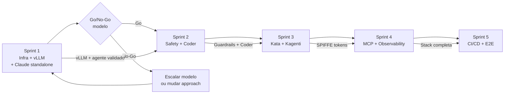

# Plan: AgentOps Platform — Sprints

**Status:** Draft
**Data:** 2026-04-08
**Relacionado:** [PRD](prd.md) | [Arquitetura](architecture.md) | [ADRs](adrs/)

---

## Visao geral

5 sprints de 1 semana cobrindo Fases 0-8 do PRD. Fase 9 (Dev Spaces) eh pos-PoC.

```
Sprint 1 ████░░░░░░░░░░░░░░░░ Infra + vLLM + Claude Code standalone
Sprint 2 ░░░░████░░░░░░░░░░░░ Safety + Coder
Sprint 3 ░░░░░░░░████░░░░░░░░ Kata + Kagenti
Sprint 4 ░░░░░░░░░░░░████░░░░ MCP Gateway + Observability
Sprint 5 ░░░░░░░░░░░░░░░░████ CI/CD + Integracao end-to-end
```

**Convencoes:**
- `[ ]` = pendente | `[x]` = feito | `[!]` = bloqueado
- **Gate** = criterio que precisa passar pra ir pro proximo sprint
- **Artefato** = arquivo/manifesto que precisa ser criado no repositorio

---

## Sprint 1 — Infra base + Inferencia + Agente standalone (Semana 1)

> **Meta:** Cluster validado, operators instalados, modelo Qwen rodando, Claude Code conversando com o modelo.
>
> **Fases PRD:** 0 + 1 + 1a

### 1.1 Pre-flight check (Fase 0)

- [x] Executar `infra/cluster/scripts/00-preflight-check.sh`
- [x] Validar versao OpenShift (4.16+) — OCP 4.20.17 confirmado
- [x] Validar acesso admin (`oc whoami`, `oc auth can-i '*' '*'`)
- [x] Validar GPU disponivel — 1x NVIDIA L4 (24GB) confirmado
- [x] Verificar operators instalados (GPU, NFD, RHOAI, Serverless, Pipelines, cert-manager)
- [x] Verificar workloads existentes que consomem GPU
- [x] Verificar pull secrets (registry.redhat.io, quay.io)
- [x] Verificar DataScienceCluster e KServe CRDs
- [ ] Validar suporte a nested virt / bare metal (requisito Kata)

### 1.2 Operators base (Fase 0)

- [x] NVIDIA GPU Operator — ja instalado no sandbox
- [x] Node Feature Discovery Operator — ja instalado
- [x] cert-manager Operator — ja instalado
- [ ] Instalar OpenShift Sandboxed Containers Operator (Kata)
- [ ] Criar KataConfig CR para habilitar runtime nos nodes

**Artefatos:**

```
infra/cluster/
├── scripts/
│   ├── config.sh                    # Variaveis de namespace
│   ├── 00-preflight-check.sh        # Investigacao completa do ambiente
│   ├── 01-setup-cluster.sh          # Namespaces, RBAC, quotas, network policies
│   └── 02-install-operators.sh      # NFD, GPU, cert-manager, Kata
├── namespaces/                      # Manifests de namespace, RBAC, quotas
├── operators/                       # Subscriptions de operators
│   ├── gpu-operator.yaml
│   ├── nfd-operator.yaml
│   ├── sandboxed-containers.yaml
│   └── cert-manager.yaml
```

### 1.3 Namespaces e RBAC (Fase 0)

- [x] Criar namespaces: `coder`, `agentops`, `agent-sandboxes`, `inference`, `mcp-gateway`, `observability`, `cicd`
- [x] Configurar NetworkPolicy base entre namespaces (corrigida em runtime — ADR-013)
- [x] Criar ResourceQuota por namespace
- [x] Configurar RBAC basico (roles pra platform engineer vs dev)

**Artefatos:**

```
infra/cluster/
├── namespaces/
│   ├── namespaces.yaml              # Todos os namespaces
│   ├── network-policies.yaml        # Regras de isolamento
│   ├── resource-quotas.yaml         # Quotas por namespace
│   └── rbac.yaml                    # Roles e RoleBindings
```

### 1.4 Inferencia local com vLLM (Fase 1)

- [x] Deploy upstream vLLM v0.19.0 como Deployment+Service no namespace `inference` (ADR-011, ADR-012)
- [x] Configurar modelo Qwen 2.5 14B Instruct FP8-dynamic no L4 24GB
- [x] Criar Service ClusterIP (nao expor externamente)
- [x] Validar `/v1/models` — modelo listado como `qwen25-14b`
- [x] Validar `/v1/chat/completions` (OpenAI API) — resposta funcional
- [x] Validar `/v1/messages` (Anthropic Messages API) — resposta funcional com codigo Python
- [ ] Executar script de validacao completo: `infra/vllm/scripts/02-validate-model.sh`
- [ ] Testar latencia com prompt simples (target: < 5s)

**Decisoes tomadas:**
- RHAIIS (Red Hat AI Inference Server) **nao tem** a Anthropic Messages API (`/v1/messages`) — ver ADR-011
- KServe `ServingRuntime`+`InferenceService` substituido por plain `Deployment`+`Service` — ver ADR-012
- Cache dirs (`HF_HOME`, `XDG_CACHE_HOME`, `HOME`) redirecionados para volumes writables (OpenShift random UID)
- `startupProbe` com 10 min de tolerancia para download do modelo
- `--max-model-len=24576` (nao 16384 nem 32768): system prompt do Claude Code consome ~12K tokens; 16K estourava com 4096 output; 32K excede KV cache do L4
- `CLAUDE_CODE_MAX_OUTPUT_TOKENS=2048` (nao 4096): complementa o ajuste de context window

**Artefatos:**

```
infra/vllm/
├── manifests/
│   ├── pvc.yaml                     # PVC 30Gi gp3-csi para model cache (ADR-014)
│   ├── deployment.yaml              # Deployment com upstream vLLM v0.19.0
│   ├── service.yaml                 # ClusterIP Service porta 8080
│   └── kustomization.yaml           # pvc + deployment + service
├── scripts/
│   ├── config.sh                    # Variaveis (imagem, modelo, namespace)
│   ├── 00-setup-namespace.sh        # Namespace + quotas
│   ├── 01-deploy-model.sh           # Apply + wait rollout
│   ├── 02-validate-model.sh         # Validacao completa (health, APIs, security, coding)
│   ├── 99-verify.sh                 # Alias para 02-validate-model.sh
│   └── 99-cleanup.sh               # Cleanup
```

### 1.5 Claude Code standalone (Fase 1a)

- [x] Criar ConfigMap `claude-code-config` no namespace `agent-sandboxes` com env vars do agente
- [x] Build e push da imagem custom (UBI9 nodejs-22 + Claude Code v2.1.96) via `oc start-build` (internal registry)
- [x] Deploy pod standalone com imagem custom
- [x] Configurar `ANTHROPIC_BASE_URL` apontando direto pro vLLM (sem Guardrails por enquanto)
- [x] Validar: `oc exec claude-code-standalone -- claude -p "What is 2+2?"` → `4` (~6s)
- [x] Testar prompts de coding progressivos:
  - [x] Funcao simples (fibonacci) — codigo correto (~9s)
  - [x] Estrutura de dados (LRU cache com type hints) — doubly-linked list correto (~101s)
- [x] Medir latencia end-to-end: ~6s pra prompt simples, ~9s pra funcao, ~101s pra classe complexa
- [x] **Go/no-go**: Qwen 14B produz codigo funcional ✓ — prosseguir pro Sprint 2

**Problemas encontrados e resolvidos:**
- Dockerfile PATH errado (`/home/default/.local/bin` → `/opt/app-root/src/.local/bin`): UBI nodejs-22 usa `HOME=/opt/app-root/src`
- Build pod OOM (exit 137 com 1Gi): Claude Code install precisa de 4Gi
- NetworkPolicy bloqueava DNS e conectividade agent→vLLM: ADR-013
- `CLAUDE_CODE_MAX_OUTPUT_TOKENS=4096` estourava context window de 16K: reduzido pra 2048 + context pra 24K
- ResourceQuota exigia limits em build pods: patch no BuildConfig
- CPU saturada no node (97%): pod Claude Code reduzido pra 100m request

**Artefatos:**

```
infra/claude-code/
├── manifests/
│   ├── configmap.yaml               # ConfigMap claude-code-config
│   └── standalone-pod.yaml          # Pod standalone
├── scripts/                         # build, deploy, verify, cleanup
└── Dockerfile                       # Image base (UBI9 nodejs-22 + Claude Code CLI)
```

**DECISAO: Go/No-Go do modelo**

Este eh o checkpoint mais importante do PoC. Se Claude Code + Qwen 2.5 14B nao produz respostas uteis pra coding, nao faz sentido montar Coder, Kata, MCP Gateway em cima. Opcoes:

| Resultado | Acao |
|---|---|
| Qwen 14B funciona bem | Continuar pro Sprint 2 |
| Qwen 14B funciona parcialmente | Testar quantizacao diferente ou Qwen 32B |
| Qwen 14B nao funciona | Avaliar modelo alternativo ou usar API cloud como fallback |

### Gate do Sprint 1

| # | Criterio | Status | Nota |
|---|---|---|---|
| G1.1 | Todos os operators em status `Succeeded` | ✅ | GPU, NFD, cert-manager, RHOAI, Serverless, Pipelines |
| G1.2 | KataConfig status `ready` nos nodes | ⏳ | Kata operator nao instalado ainda (bare metal pre-req pendente) |
| G1.3 | vLLM respondendo em `/v1/messages` e `/v1/chat/completions` | ✅ | upstream vLLM v0.19.0 (ADR-011, ADR-012) |
| G1.4 | Claude Code standalone conversa com vLLM (AC-0) | ✅ | fibonacci, LRU cache, math — todos funcionais |
| G1.5 | Latencia < 5s para prompt simples | ✅ | ~6s (math), ~9s (function), ~101s (class) |
| G1.6 | Go/no-go do modelo: codigo gerado eh funcional | ✅ GO | Qwen 14B produz codigo correto e com type hints |
| G1.7 | Namespaces e NetworkPolicies criadas | ✅ | Corrigido em Sprint 1 (ADR-013) |

---

## Sprint 2 — Safety + CDE (Semana 2)

> **Meta:** Guardrails interceptando requests. Coder rodando com workspaces funcionais. Agente standalone migra pra Guardrails.
>
> **Fases PRD:** 2 + 3

### 2.0 Hardening Sprint 1 (carry-over)

- [x] Adicionar egress NetworkPolicy para namespace `inference` (DNS + HuggingFace 443 only)
- [x] Migrar `model-cache` de `emptyDir` para `PVC` 30Gi gp3-csi (modelo 16GB persistido, restart sem re-download)
- [x] Remover NetworkPolicies temporarias (`allow-claude-egress-temp`, `allow-builds-egress`)
- [x] Rebuild imagem Claude Code com PATH corrigido (`/opt/app-root/src/.local/bin`)

### 2.1 TrustyAI Guardrails (Fase 2)

- [ ] Instalar Red Hat OpenShift AI Operator
- [ ] Habilitar TrustyAI no DataScienceCluster (`managementState: Managed`)
- [ ] Deploy Guardrails Orchestrator CRD no namespace `inference`
- [ ] Configurar detector PII: email, telefone, CPF, cartao, IP (regex)
- [ ] Configurar detector de content filtering basico
- [ ] Validar: request com PII retorna `400 Blocked`
- [ ] Validar: request limpo passa pro vLLM e retorna resposta

**Artefatos:**

```
infra/guardrails/
├── manifests/
│   ├── guardrails-orchestrator.yaml # CRD do orchestrator
│   ├── orchestrator-config.yaml     # Config do orchestrator
│   └── gateway-config.yaml          # Rotas do gateway
├── scripts/                         # check, deploy, verify
```

### 2.2 NeMo Guardrails (Fase 2 — opcional, tech preview)

- [ ] Deploy NeMo Guardrails no namespace `inference`
- [ ] Criar Colang rules basicas (jailbreak, prompt injection)
- [ ] Configurar chain: Agent → TrustyAI → NeMo → vLLM
- [ ] Validar output rails (PII leak prevention na resposta)

**Artefatos:**

```
infra/nemo/
├── deployment.yaml
└── colang-rules/
    ├── input-rails.co               # Regras de input
    └── output-rails.co              # Regras de output
```

### 2.2a Migrar standalone pra Guardrails

- [ ] Atualizar ConfigMap `claude-code-config`: `ANTHROPIC_BASE_URL` → Guardrails endpoint
- [ ] Reiniciar pod standalone
- [ ] Validar: Claude Code continua respondendo via Guardrails → vLLM
- [ ] Validar: request com PII bloqueado no standalone tambem

### 2.3 Coder como CDE (Fase 3)

- [ ] Deploy PostgreSQL via OperatorHub no namespace `coder`
- [ ] Helm install Coder v2 com SecurityContext compativel com `restricted-v2`
- [ ] Criar Route OpenShift com TLS termination
- [ ] Configurar OIDC auth (OpenShift OAuth)
- [ ] Criar Terraform template reusando ConfigMap `claude-code-config` do Sprint 1:
  - Mesma imagem custom (UBI9 + Claude Code) ja validada
  - Git + ferramentas de dev
  - `envFrom: configMapRef: claude-code-config`
- [ ] Validar: dev acessa Coder UI, cria workspace, Claude Code responde

**Artefatos:**

```
coder/
├── postgres/
│   └── postgres.yaml                # Operator CR ou StatefulSet
├── helm/
│   └── values.yaml                  # Helm values pro Coder
├── route.yaml                       # Route com TLS
├── oauth/
│   └── oidc-config.yaml             # Configuracao OIDC
└── templates/
    └── claude-workspace/
        ├── main.tf                  # Terraform template
        └── variables.tf
```

### Gate do Sprint 2

| # | Criterio | Validacao |
|---|---|---|
| G2.1 | Request com PII bloqueado pelo TrustyAI (AC-5) | Teste com CPF/email no prompt |
| G2.2 | Request limpo chega no vLLM e retorna resposta | `curl` via Guardrails endpoint |
| G2.3 | Coder UI acessivel via Route com TLS | Browser |
| G2.4 | Dev cria workspace e Claude Code funciona (AC-1) | Teste manual end-to-end |
| G2.5 | Auth OIDC funciona (login via OpenShift) | Teste manual |

---

## Sprint 3 — Isolamento + Identidade (Semana 3)

> **Meta:** Workspaces rodando em Kata VMs. Agentes com identidade SPIFFE.
>
> **Fases PRD:** 4 + 5

### 3.1 Kata Containers (Fase 4)

- [ ] Validar KataConfig ready nos nodes (`oc get kataconfig -o yaml`)
- [ ] Atualizar Terraform template do Coder: `runtimeClassName: kata`
- [ ] Testar: workspace roda em Kata VM (`uname -r` diferente do host)
- [ ] Configurar NetworkPolicy restritiva pra `agent-sandboxes`:
  - Permite: `inference` (8080), `mcp-gateway` (8443), `observability` (4317), `kube-dns` (53)
  - Bloqueia: todo o resto
- [ ] Validar: agente nao consegue acessar services nao-autorizados

**Artefatos:**

```
infra/cluster/
├── namespaces/
│   └── network-policies.yaml        # Atualizar com regras restritivas
coder/
└── templates/
    └── claude-workspace/
        └── main.tf                  # Atualizar com runtimeClassName: kata
```

### 3.2 Kagenti + SPIFFE (Fase 5)

- [ ] Deploy SPIRE server no namespace `agentops`
- [ ] Deploy Kagenti Operator no namespace `agentops`
- [ ] Configurar labels `kagenti.io/type: agent` nos pods do workspace
- [ ] Validar auto-discovery: Kagenti detecta pods com label
- [ ] Validar sidecar injection: `spiffe-helper` e `kagenti-client-registration`
- [ ] Validar SVID no filesystem do pod
- [ ] Deploy Keycloak (ou usar existente)
- [ ] Configurar token exchange: SVID → OAuth2 token com claims (role, namespace, agent-id)

**Artefatos:**

```
agentops/
├── spire/
│   ├── server.yaml                  # SPIRE server deployment
│   ├── agent.yaml                   # SPIRE agent daemonset
│   └── registration-entries.yaml    # Entries pra workload attestation
├── kagenti/
│   ├── operator.yaml                # Kagenti Operator deployment
│   └── agentcard-sample.yaml        # Exemplo de AgentCard CRD
└── keycloak/
    ├── deployment.yaml              # Keycloak (se nao existir)
    └── realm-config.json            # Realm com token exchange
```

### Gate do Sprint 3

| # | Criterio | Validacao |
|---|---|---|
| G3.1 | `uname -r` dentro do workspace != `uname -r` do host (AC-2) | Exec no pod |
| G3.2 | NetworkPolicy bloqueia acesso nao-autorizado (AC-8) | `curl` pra service nao-permitido → timeout |
| G3.3 | SVID presente no filesystem do pod (AC-3) | `ls /run/spire/sockets/` |
| G3.4 | Token exchange funciona: SVID → JWT com claims | Teste via Keycloak |
| G3.5 | Kagenti cria AgentCard automaticamente | `oc get agentcards -n agent-sandboxes` |

---

## Sprint 4 — Governanca + Observabilidade (Semana 4)

> **Meta:** Tools governadas por identidade. Traces de tudo no MLflow.
>
> **Fases PRD:** 6 + 7

### 4.1 MCP Gateway (Fase 6)

- [ ] Instalar Sail Operator (Istio) via OperatorHub
- [ ] Instalar Gateway API CRDs
- [ ] Deploy MCP Gateway (Envoy-based) via Helm no namespace `mcp-gateway`
- [ ] Configurar MCP servers backend: GitHub, filesystem
- [ ] Instalar Kuadrant + Authorino
- [ ] Configurar AuthPolicy: validacao JWT dos tokens do Keycloak
- [ ] Definir policies OPA por role:
  - `developer`: filesystem read/write, github read
  - `senior-developer`: tudo de developer + github create_pr
  - `admin`: acesso total
- [ ] Configurar Claude Code: `MCP_URL` aponta pro gateway
- [ ] Validar: tool list filtrada por role do token
- [ ] Validar: tool call nao-autorizada retorna 403

**Artefatos:**

```
mcp-gateway/
├── helm/
│   └── values.yaml                  # Helm values pro MCP Gateway
├── gateway-api/
│   ├── gateway.yaml                 # Gateway resource
│   └── httproute.yaml               # Routes pros MCP servers
├── auth/
│   ├── authpolicy.yaml              # Kuadrant AuthPolicy
│   ├── authorino.yaml               # Authorino config
│   └── opa-policies/
│       ├── developer.rego           # Policy pra role developer
│       └── admin.rego               # Policy pra role admin
└── mcp-servers/
    ├── github.yaml                  # MCP server GitHub
    └── filesystem.yaml              # MCP server filesystem
```

### 4.2 Observabilidade (Fase 7)

- [ ] Deploy OTEL Collector no namespace `observability`
- [ ] Configurar receiver OTLP (gRPC :4317, HTTP :4318)
- [ ] Deploy MLflow Tracking Server com storage (PV ou S3)
- [ ] Configurar OTEL exporter → MLflow
- [ ] Configurar Claude Code: `OTEL_EXPORTER_OTLP_ENDPOINT`
- [ ] Validar: traces aparecem no MLflow apos tool call
- [ ] Criar dashboards basicos: tokens/hora, tool calls/agente, latencia

**Artefatos:**

```
observability/
├── otel/
│   ├── collector.yaml               # OTEL Collector deployment + config
│   └── service.yaml                 # Service ClusterIP
├── mlflow/
│   ├── deployment.yaml              # MLflow Tracking Server
│   ├── pvc.yaml                     # Storage
│   └── service.yaml
└── dashboards/
    └── agent-metrics.json           # Dashboard config (se aplicavel)
```

### Gate do Sprint 4

| # | Criterio | Validacao |
|---|---|---|
| G4.1 | Tools filtradas por role do token no MCP Gateway (AC-4) | `tools/list` com tokens de roles diferentes |
| G4.2 | Tool call nao-autorizada retorna 403 | `tools/call` com token sem permissao |
| G4.3 | Traces de tool calls aparecem no MLflow (AC-6) | UI do MLflow |
| G4.4 | Dados capturados: prompts, tokens, latencia, tools | Inspecionar traces |
| G4.5 | OTEL Collector recebendo spans | `oc logs` do collector |

---

## Sprint 5 — CI/CD + Integracao (Semana 5)

> **Meta:** Pipeline de safety scan. Teste end-to-end de toda a stack.
>
> **Fases PRD:** 8 + integracao

### 5.1 Tekton + Garak (Fase 8)

- [ ] Instalar Tekton Pipelines Operator via OperatorHub
- [ ] Criar Task `garak-scan`: roda Garak adversarial probes contra o vLLM
- [ ] Criar Task `agent-deploy`: deploy de agente via Kagenti
- [ ] Criar Task `smoke-test`: validacao basica pos-deploy
- [ ] Criar Pipeline: `garak-scan` → `agent-deploy` → `smoke-test`
- [ ] Configurar triggers (EventListener + TriggerTemplate)
- [ ] Validar: pipeline bloqueia deploy quando Garak detecta vulnerabilidade
- [ ] Validar: pipeline permite deploy quando scan passa

**Artefatos:**

```
cicd/
├── tekton/
│   ├── tasks/
│   │   ├── garak-scan.yaml          # Task de scan adversarial
│   │   ├── agent-deploy.yaml        # Task de deploy via Kagenti
│   │   └── smoke-test.yaml          # Task de validacao
│   ├── pipelines/
│   │   └── agent-safety-pipeline.yaml
│   └── triggers/
│       ├── event-listener.yaml
│       └── trigger-template.yaml
```

### 5.2 Integracao end-to-end

- [ ] Teste E2E completo:
  1. Dev acessa Coder → cria workspace
  2. Workspace roda em Kata VM
  3. Claude Code usa modelo local via Guardrails
  4. Tools acessadas via MCP Gateway (filtradas por role)
  5. Traces aparecem no MLflow
  6. PII bloqueado pelo TrustyAI
- [ ] Validar todos os criterios de aceitacao (AC-1 a AC-8)
- [ ] Medir metricas de sucesso (PRD secao 10)
- [ ] Documentar resultados e gaps

**Artefatos:**

```
docs/
├── results/
│   ├── acceptance-criteria.md       # Resultado de cada AC
│   ├── metrics.md                   # Metricas medidas vs targets
│   └── gaps.md                      # Gaps encontrados e proximos passos
```

### 5.3 Housekeeping

- [ ] Criar README.md do repositorio
- [ ] Criar `.gitignore`
- [ ] Revisar e atualizar docs com aprendizados
- [ ] Documentar troubleshooting / runbook

### Gate do Sprint 5

| # | Criterio | Validacao |
|---|---|---|
| G5.1 | Pipeline Tekton roda Garak e bloqueia modelo vulneravel (AC-7) | PipelineRun com falha proposital |
| G5.2 | Fluxo E2E funciona: Coder → Kata → Guardrails → vLLM → MCP → OTEL | Teste manual completo |
| G5.3 | Todos os 8 criterios de aceitacao passam | Checklist |
| G5.4 | Metricas documentadas vs targets do PRD | `docs/results/metrics.md` |

---

## Pos-PoC — Dev Spaces (Fase 9)

> **Meta:** Alternativa ao Coder usando Dev Spaces. Nao eh bloqueante pro PoC.

- [ ] Instalar Dev Spaces Operator
- [ ] Criar Devfile com Claude Code + tooling
- [ ] Integrar com vLLM / MCP Gateway / OTEL existentes
- [ ] Comparar DX: Coder vs Dev Spaces

---

## Estrutura de artefatos (repositorio)

```
claude-code-openshift/
├── README.md
├── .gitignore
├── docs/
│   ├── prd.md
│   ├── architecture.md
│   ├── plan.md                      ← este arquivo
│   ├── cluster-info.md              # Specs do cluster (Sprint 1)
│   ├── adrs/
│   ├── references/
│   └── results/                     # Resultados do PoC (Sprint 5)
├── infra/
│   ├── claude-code/                 # Agent image, manifests, scripts
│   ├── cluster/                     # Operators, NS, NetworkPolicy, Quotas, RBAC
│   ├── vllm/                        # KServe model serving
│   ├── guardrails/                  # TrustyAI config
│   └── nemo/                        # NeMo Guardrails (opcional)
├── coder/
│   ├── helm/                        # Helm values do Coder
│   ├── postgres/                    # PostgreSQL
│   ├── oauth/                       # OIDC config
│   └── templates/                   # Terraform workspace templates
├── agentops/
│   ├── spire/                       # SPIRE server/agent
│   ├── kagenti/                     # Kagenti Operator
│   └── keycloak/                    # Keycloak / token exchange
├── mcp-gateway/
│   ├── helm/                        # MCP Gateway
│   ├── gateway-api/                 # Gateway + HTTPRoutes
│   ├── auth/                        # AuthPolicy + OPA
│   └── mcp-servers/                 # GitHub, filesystem
├── observability/
│   ├── otel/                        # OTEL Collector
│   ├── mlflow/                      # MLflow Tracking Server
│   └── dashboards/                  # Dashboard configs
└── cicd/
    └── tekton/                      # Tasks, Pipelines, Triggers
```

---

## Dependencias entre sprints



**Dependencias criticas:**
- Sprint 1 tem **go/no-go**: agente + modelo funcionam? Se nao, resolve antes de investir no resto
- Sprint 2 depende do vLLM + agente standalone validados (Sprint 1)
- Sprint 3 depende do Coder funcional (Sprint 2) pra testar Kata nos workspaces
- Sprint 4 depende dos tokens SPIFFE (Sprint 3) pra autenticar no MCP Gateway
- Sprint 5 eh integracao — depende de tudo

---

## Riscos por sprint

| Sprint | Risco principal | Mitigacao |
|---|---|---|
| 1 | Cluster sem nested virt → Kata nao funciona | Validar primeiro; fallback gVisor |
| 1 | GPU insuficiente pro modelo | Quantizacao agressiva (Q5) ou Qwen 7B |
| 1 | Claude Code incompativel com API do vLLM/Qwen | Testar no standalone; ajustar env vars ou modelo |
| 1 | Qwen 2.5 14B gera codigo ruim | Go/no-go no Sprint 1; escalar antes de investir no resto |
| 2 | Coder SCC conflicts com restricted-v2 | Seguir doc oficial; testar com anyuid se necessario |
| 2 | TrustyAI latencia alta | Medir; desabilitar detectors pesados |
| 3 | Kagenti alpha — breaking changes | Pintar versao; manter workaround manual |
| 4 | MCP Gateway tech preview — instavel | Pintar versao; configuracao estatica como fallback |
| 5 | Garak scan demora demais | Limitar probes; timeout na pipeline |
